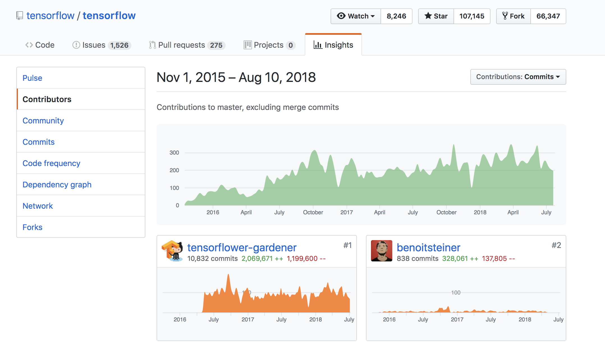
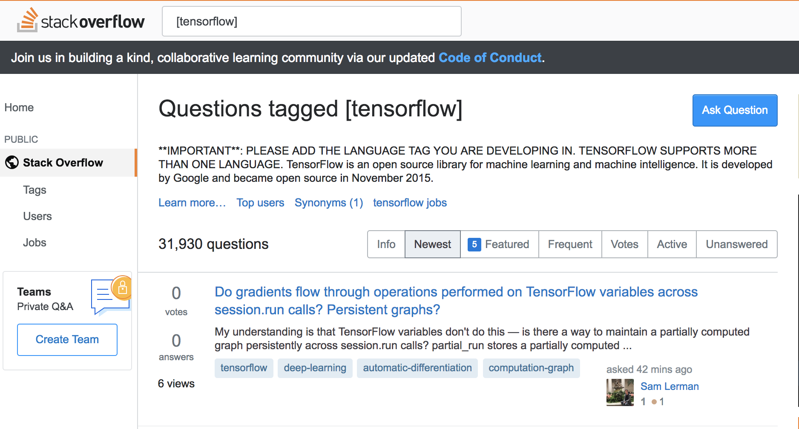
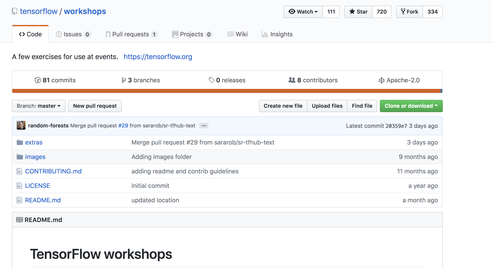

TensorFlow Tutorial
###################

Open Source Software - Summer 2018

Wesley Turner

Rensselaer Polytechnic Institute

Department of Computer Science

.. nextslide::

Licensed under: CC-BY-SA 4.0 https://creativecommons.org/licenses/by-sa/4.0/

Introduction
============

What is TensorFlow?
-------------------

.. pull-quote:: An open source machine learning framework for everyone [1]_

.. [1] https://www.tensorflow.org/

.. nextslide::

TensorFlow™ is:

* Open source 
  
* High performance numerical computation
  
* Deploys on  CPUs, GPUs, TPU
  
* Desktops, clusters, mobile and edge devices
 
* Originally developed by Google Brain team within Google’s AI organization
  
.. nextslide::

TensorFlow™ has:

* Strong support for machine learning 
  
* Strong support for deep learning
 
* Flexible numerical computation core

Widely Used
-----------

Companies:

.. image:: static/Companies1.png

.. nextslide::

Companies (continued):

.. image:: static/Companies2.png

.. nextslide::

Companies (continued):

.. image:: static/Companies3.png

By the Numbers
--------------

Github page: https://github.com/tensorflow

.. image:: static/github1.png

.. nextslide::

Main repository: https://github.com/tensorflow/tensorflow

* 38,056 commits

* 25 branches

* 1600 contributers

* 1526 Issues

* Permissively licensed under Apache-2.0

.. image:: static/License.png

.. nextslide::

Active community
----------------

* Community overview: https://www.tensorflow.org/community/

.. image:: static/Community.png

.. nextslide::

* Insights at: https://github.com/tensorflow/tensorflow/graphs/contributors

.. nextslide::

* Blog: https://medium.com/tensorflow

.. image:: static/Blog.png

.. nextslide::

* Issue Tracker: https://github.com/tensorflow/tensorflow/issues

.. image:: static/Issues.png

.. nextslide::

* Issue Tracker: https://stackoverflow.com/questions/tagged/tensorflow

.. nextslide::

Others:

* Twitter

* YouTube

* Release Notes

Using TensorFlow
================

Multiple Installations
----------------------

* Virtualenv
 
* "native" pip

* Docker

* Source

For this class, we will use the Docker installation:

.. code-block:: console

  $ docker run -it -p 8888:8888 tensorflow/tensorflow:latest-devel
  Unable to find image 'tensorflow/tensorflow:latest-devel' locally
  latest-devel: Pulling from tensorflow/tensorflow
  8ee29e426c26: Pull complete 
  ...
  d7422f948262: Pull complete 
  Digest: sha256:846961b09ce9d8bd5b787c0163a223e2ffca639aef7cdc17fdf0191a19083ef1
  Status: Downloaded newer image for tensorflow/tensorflow:latest-devel
  
.. nextslide::

Docker:

* Runs a TensorFLow Container

  * Bindings to Python

* Maps port 8888 on the Container to port 8888 outside the container

  * Allows you to run Jupyter Notebooks

* Starts up an interactive session

Validate
--------

From the Docker container:

.. code-block:: console

  # python
  Python 2.7.12 (default, Dec  4 2017, 14:50:18) 
  [GCC 5.4.0 20160609] on linux2
  Type "help", "copyright", "credits" or "license" for more information.

.. code-block:: python

  >>> import tensorflow as tf
  >>> hello = tf.constant('Hello, TensorFlow!')
  >>> sess = tf.Session()
  2018-08-09 19:31:10.894780: I tensorflow/core/platform/cpu_feature_guard.cc:141] Your CPU supports instructions that this TensorFlow binary was not compiled to use: AVX2 FMA
  >>> print sess.run(hello) 
  Hello, TensorFlow!

Tutorial
--------

Of course, Google has us covered:
https://www.youtube.com/watch?v=tjsHSIG8I08

.. image:: static/Video.png

.. nextslide::

Website from the video:
https://github.com/tensorflow/workshops

.. nextslide::

Other links:

* https://colab.research.google.com/

* https://js.tensorflow.org/

* https://ai.google/education/

