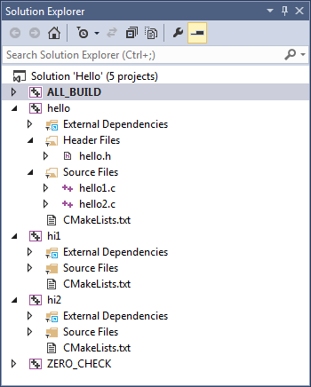

Build Systems
#############

RPI Open Source Software - Spring 2016

Brad King, Kitware, Inc.

* Maintainer of CMake
* RPI '00 BS, '08 PhD

Introduction
============

What is a Build System?
-----------------------

* Specifies how to turn source files into useful programs.

.. blockdiag::

   blockdiag {
     default_fontsize = 20;

     Sources [ stacked ];
     BuildSystem [ label = "Build System", shape = roundedbox, width = 192 ];
     Programs [ stacked ];

     Sources -> BuildSystem -> Programs;
   }

* Organizes code to share among programs.

* Requirements vary by language, tools, and platform;
  here we focus on ``C`` and ``C++`` languages.

Motivation
==========

One Source File
---------------

Consider a source file ``hi.c``:

.. code-block:: c

  #include <stdio.h>
  int main() {
    printf("hello\n");
    return 0;
  }

Compile and run the program:

.. code-block:: console

  $ cc hi.c -o hi
  $ ./hi
  hello

Build System: Compiler Driver
-----------------------------

The compiler driver is a simple build system.

It runs the compiler and linker internally:

.. code-block:: console

  $ gcc hi.c -o hi -###
  cc1 hi.c -o /tmp/tmp1.o
  collect2 -o hi /tmp/tmp1.o -lgcc ...

Reusable Source File
--------------------

Declare a ``hello()`` function in a ``hello.h`` header:

.. code-block:: c

  void hello(void);

Implement the function in a ``hello.c`` source:

.. code-block:: c

  #include "hello.h"
  #include <stdio.h>
  void hello(void) {
    printf("hello\n");
  }

.. nextslide::

Update main program in the ``hi.c`` source:

.. code-block:: c

  #include "hello.h"
  int main(void) {
    hello();
    return 0;
  }

Give both source files to the compiler driver:

.. code-block:: console

  $ cc hi.c hello.c -o hi
  $ ./hi
  hello

.. nextslide::

The compiler driver runs the compiler and linker internally:

.. code-block:: console

  $ gcc hi.c hello.c -o hi -###
  cc1 hi.c -o /tmp/tmp1.o
  cc1 hello.c -o /tmp/tmp2.o
  collect2 -o hi /tmp/tmp1.o /tmp/tmp2.o -lgcc ...

Sharing Source Files
--------------------

Rename original ``hi.c`` to ``hi1.c``:

.. code-block:: console

  $ mv hi.c hi1.c

Add a ``hi2.c`` executable sharing the ``hello()`` function:

.. code-block:: c

  #include "hello.h"
  int main(void) {
    hello();
    hello();
    return 0;
  }

.. nextslide::

Use ``hello.c`` source file for both programs:

.. code-block:: console

  $ cc hi1.c hello.c -o hi1
  $ cc hi2.c hello.c -o hi2
  $ ./hi1
  hello
  $ ./hi2
  hello
  hello

Build System: Shell Script
--------------------------

List commands in a shell script, e.g. ``build.sh``:

.. code-block:: bash

  cc hi1.c hello.c -o hi1
  cc hi2.c hello.c -o hi2

Run the script to drive the build:

.. code-block:: console

  $ sh -x build.sh
  + cc hi1.c hello.c -o hi1
  + cc hi2.c hello.c -o hi2

Sharing Source Files
--------------------

The compiler driver runs the compiler and linker internally:

.. code-block:: console

  $ gcc hi1.c hello.c -o hi1 -###
  cc1 hi1.c -o /tmp/tmp1.o
  cc1 hello.c -o /tmp/tmp2.o
  collect2 -o hi1 /tmp/tmp1.o /tmp/tmp2.o -lgcc ...
  $ gcc hi2.c hello.c -o hi2 -###
  cc1 hi2.c -o /tmp/tmp1.o
  cc1 hello.c -o /tmp/tmp2.o
  collect2 -o hi2 /tmp/tmp1.o /tmp/tmp2.o -lgcc ...

* Compiles ``hello.c`` twice.
* Re-uses source file but not compiler output.

Sharing Object Files
--------------------

* Compile ``hello.c`` to an *object file*.
* Use the object file to link each executable.
* Called "separate compilation".

.. code-block:: console

  $ sh -x build.sh
  + cc -c hello.c -o hello.o
  + cc hi1.c hello.o -o hi1
  + cc hi2.c hello.o -o hi2
  $ ./hi1
  hello
  $ ./hi2
  hello
  hello

.. nextslide::

The compiler driver runs the compiler and linker internally:

.. code-block:: console

  $ gcc hello.c -o hello.o -###
  cc1 hello.c -o hello.o
  $ gcc hi1.c hello.o -o hi1 -###
  cc1 hi1.c -o /tmp/tmp1.o
  collect2 -o hi1 /tmp/tmp1.o hello.o -lgcc ...
  $ gcc hi2.c hello.o -o hi2 -###
  cc1 hi2.c -o /tmp/tmp1.o
  collect2 -o hi2 /tmp/tmp1.o hello.o -lgcc ...

* Compiles ``hello.c`` only once.

Sharing Multiple Sources
------------------------

Split ``hello.c`` into ``hello1.c``:

.. code-block:: c

  #include "hello.h"
  extern void print_hello(const char *s);
  void hello(void) {
    print_hello("world");
  }

and ``hello2.c``:

.. code-block:: c

  #include <stdio.h>
  void print_hello(const char *s) {
    printf("hello: %s\n", s);
  }

.. nextslide::

.. code-block:: console

  $ sh -x build.sh
  + cc -c hello1.c -o hello1.o
  + cc -c hello2.c -o hello2.o
  + cc -c hi1.c -o hi1.o
  + cc -c hi2.c -o hi2.o
  + cc hi1.o hello1.o hello2.o -o hi1
  + cc hi2.o hello1.o hello2.o -o hi2
  $ ./hi1
  hello: world
  $ ./hi2
  hello: world
  hello: world

Callers of ``hello()`` function must use both
``hello1.o`` and ``hello2.o`` together, but
should not have to know that.

Static Libraries
----------------

Create an archive of object files; use to link executables:

.. code-block:: console

  $ sh -x build.sh
  + cc -c hello1.c -o hello1.o
  + cc -c hello2.c -o hello2.o
  + ar qc libhello.a hello1.o hello2.o
  + cc -c hi1.c -o hi1.o
  + cc -c hi2.c -o hi2.o
  + cc hi1.o libhello.a -o hi1
  + cc hi2.o libhello.a -o hi2
  $ ./hi1
  hello: world
  $ ./hi2
  hello: world
  hello: world

.. nextslide::

List the object files in the archive:

.. code-block:: console

  $ ar t libhello.a
  hello1.o
  hello2.o

Shared Libraries
----------------

Link object files into a shared library; link executables to it:

.. code-block:: console

  $ sh -x build.sh
  + cc -fPIC -c hello1.c -o hello1.o
  + cc -fPIC -c hello2.c -o hello2.o
  + cc -shared -o libhello.so hello1.o hello2.o
  + cc -c hi1.c -o hi1.o
  + cc -c hi2.c -o hi2.o
  + cc hi1.o libhello.so -o hi1 -Wl,-rpath='$ORIGIN'
  + cc hi2.o libhello.so -o hi2 -Wl,-rpath='$ORIGIN'
  $ ./hi1
  hello: world
  $ ./hi2
  hello: world
  hello: world

.. nextslide::

View dependency of executable on shared library:

.. code-block:: console

  $ readelf -d hi1 | grep NEEDED
   0x0000000000000001 (NEEDED) Shared library: [libhello.so]
   0x0000000000000001 (NEEDED) Shared library: [libc.so.6]
  $ readelf -d hi1 | grep RPATH
   0x000000000000000f (RPATH) Library rpath: [$ORIGIN]

Review of File Types
--------------------

**Source files** (``*.c``, ``*.cpp``)
  Define "symbols" implementing functions and storage of global data.
**Header files** (``*.h``, ``*.hpp``)
  Define interfaces shared among source files
  (e.g. function prototypes).
**Object files** (``*.o``, ``*.obj`` on Windows)
  Compiler output from source files.
**Executables** (no extension, ``*.exe`` on Windows)
  Object files linked together into programs with ``main``.

.. nextslide::

**Static libraries** (``*.a``, ``*.lib`` with MS tools)
  * Archives of object files.
  * Searched by linker for objects implementing needed symbols.
  * All symbols with "extern linkage" exposed publicly.
**Shared libraries** (``*.so``, ``*.dll`` on Windows)
  * Objects linked together into libraries loaded by programs at runtime.
  * A subset of symbols with "extern linkage" exposed publicly
    via explicit markup.
  * On Windows, associated "import library" (``.lib``).

Build System: Shell Script
--------------------------

* ``build.sh`` always runs all commands.
* No concurrency.
* No partial builds.
* No incremental rebuilds.
* Does not scale.
* Rarely used in practice.

Build System: Make
==================

Build Dependencies
------------------

.. blockdiag::

   blockdiag {
     default_fontsize = 20;

     hi1 -> hi1.o, libhello.so
     hi2 -> hi2.o, libhello.so
     hi1.o -> hi1.c
     hi2.o -> hi2.c
     libhello.so -> hello1.o, hello2.o
     hello1.o -> hello1.c
     hello2.o -> hello2.c
   }

Makefile
--------

A ``Makefile`` expresses build dependencies:

.. code-block:: makefile

  all: hi1 hi2
  hi1: hi1.o libhello.so
  hi2: hi2.o libhello.so
  hi1.o: hi1.c
  hi2.o: hi2.c
  libhello.so: hello1.o hello2.o
  hello1.o: hello1.c
  hello2.o: hello2.c

.. nextslide::

A ``Makefile`` also specifies build commands:

.. code-block:: makefile

  all: hi1 hi2
  hi1: hi1.o libhello.so
          cc hi1.o libhello.so -o hi1 -Wl,-rpath='$$ORIGIN'
  hi2: hi2.o libhello.so
          cc hi2.o libhello.so -o hi2 -Wl,-rpath='$$ORIGIN'
  hi1.o: hi1.c
          cc -c hi1.c -o hi1.o
  hi2.o: hi2.c
          cc -c hi2.c -o hi2.o
  libhello.so: hello1.o hello2.o
          cc -shared -o libhello.so hello1.o hello2.o
  hello1.o: hello1.c
          cc -fPIC -c hello1.c -o hello1.o
  hello2.o: hello2.c
          cc -fPIC -c hello2.c -o hello2.o

Run Make Tool
-------------

Run ``make`` tool to drive build process:

.. code-block:: console

  $ make
  cc -c hi1.c -o hi1.o
  cc -fPIC -c hello1.c -o hello1.o
  cc -fPIC -c hello2.c -o hello2.o
  cc -shared -o libhello.so hello1.o hello2.o
  cc hi1.o libhello.so -o hi1 -Wl,-rpath='$ORIGIN'
  cc -c hi2.c -o hi2.o
  cc hi2.o libhello.so -o hi2 -Wl,-rpath='$ORIGIN'
  $ ./hi1
  hello: world
  $ ./hi2
  hello: world
  hello: world

.. nextslide::

The ``make`` tool checks timestamps, follows dependencies:

.. code-block:: console

  $ make
  make: Nothing to be done for 'all'.
  $ touch hello2.c
  $ make
  cc -fPIC -c hello2.c -o hello2.o
  cc -shared -o libhello.so hello1.o hello2.o
  cc hi1.o libhello.so -o hi1 -Wl,-rpath='$ORIGIN'
  cc hi2.o libhello.so -o hi2 -Wl,-rpath='$ORIGIN'
  $ make
  make: Nothing to be done for 'all'.

Implicit Dependencies
---------------------

Header files (``*.h``) are *implicit* dependencies of compilation:

.. code-block:: console

  $ grep hello.h *.c
  hello1.c:#include "hello.h"
  hi2.c:#include "hello.h"
  hi1.c:#include "hello.h"

The compiler can tell us about dependencies:

.. code-block:: console

  $ gcc -MM hello1.c -MT hello1.o
  hello1.o: hello1.c hello.h

.. nextslide::

Implicit dependencies not yet expressed in our ``Makefile``:

.. code-block:: console

  $ touch hello.h
  $ make
  make: Nothing to be done for 'all'.

.. nextslide::

.. blockdiag::

   blockdiag {
     default_fontsize = 20;

     hi1 -> hi1.o, libhello.so
     hi2 -> hi2.o, libhello.so
     hi1.o -> hi1.c
     hi2.o -> hi2.c
     libhello.so -> hello1.o, hello2.o
     hello1.o -> hello1.c
     hello2.o -> hello2.c

     hello.h [color = pink]
     hello1.o -> hello.h [color = red]
     hi1.o -> hello.h [color = red]
     hi2.o -> hello.h [color = red]
   }

Makefile: Implicit Dependencies
-------------------------------

Extend our ``Makefile`` with implicit dependencies:

.. code-block:: makefile

  hi1.o: hello.h
  hi2.o: hello.h
  hello1.o: hello.h

.. code-block:: console

  $ make
  cc -c hi1.c -o hi1.o
  cc -fPIC -c hello1.c -o hello1.o
  cc -shared -o libhello.so hello1.o hello2.o
  cc hi1.o libhello.so -o hi1 -Wl,-rpath='$ORIGIN'
  cc -c hi2.c -o hi2.o
  cc hi2.o libhello.so -o hi2 -Wl,-rpath='$ORIGIN'

Everything but ``hello2.o`` rebuilds when ``hello.h`` changes.

Build System: Make
------------------

* Features:

  - Dependencies enable efficient, concurrent (re-)builds.

* Limitations:

  - Tricky to maintain implicit dependencies.
  - Platform- and tool-specific tables of commands.
  - Build rules do not re-run when commands change.
  - Need manual rules for "install" and "clean" operations.
  - Not reusable with IDEs like Visual Studio and Xcode.

Build System: MSBuild
---------------------

Underlies Visual Studio 2010+ builds.

.. code-block:: xml

  <Project DefaultTargets="Build" ToolsVersion="12.0" ...>
    ...
    <ItemGroup>
      <ClCompile Include="hi1.c" />
    </ItemGroup>
    <ItemGroup>
      <ProjectReference Include="hello.vcxproj">
        <Project>158CE2ED-F99F-4D09-A981-CF4C46D9A63B</Project>
      </ProjectReference>
    </ItemGroup>
    ...
  </Project>

.. nextslide::

* Features:

  - Create and update through Visual Studio IDE.
  - Handles implicit dependencies automatically.
  - Built-in "clean" operations.

* Limitations:

  - Platform- and tool-specific.  Not portable.
  - Need manual rules for "install" operations.
  - Difficult to merge version control branches.

Example Build Systems
---------------------

* `Make <https://en.wikipedia.org/wiki/Make_%28software%29>`__:
  Canonical dependency-based build system.
* `Ninja <https://martine.github.io/ninja/>`__:
  An "assembly language for build systems".  Designed to be generated.
* `MSBuild <https://msdn.microsoft.com/en-us/library/0k6kkbsd.aspx>`__:
  Underlies Visual Studio 2010+ builds.
* `Waf <https://github.com/waf-project/waf>`__,
  `Scons <http://www.scons.org/>`__:
  Python-based build system frameworks.

Generating Build Systems
========================

Build System Generators
-----------------------

Transform a common input specification into platform- and
tool-specific build files.  Examples:

* `GNU Build System (autotools) <http://www.gnu.org/software/automake/manual/html_node/GNU-Build-System.html>`__:
  Generates ``configure`` script for distribution with source code
  to generate `GNU make <https://www.gnu.org/software/make/>`__
  build files for local system.
* `CMake <https://cmake.org>`__:
  Generates for Make, Ninja, Visual Studio, or Xcode build files
  for local system.
* `Premake <https://premake.github.io/>`__,
  `GYP <https://chromium.googlesource.com/external/gyp>`__:
  Generate re-distributable GNU Make, Visual Studio, and Xcode build files.

CMake
-----

* Created by `Kitware <http://kitware.com>`__ in 2000 to support
  cross-platform builds for the `Insight Toolkit <http://itk.org>`__.
  Sponsored originally by the `US NLM <https://www.nlm.nih.gov/>`__.

* Generalized incrementally over time.

* `KDE <https://www.kde.org>`__ (K Desktop Environment)
  switched to CMake in 2006; kicked off widespread adoption.

* Now de-facto standard for cross-platform ``C``, ``C++``, and
  ``Fortran`` projects.

* Homepage: https://cmake.org

* Documentation: https://cmake.org/documentation

CMake Example Code
------------------

Create a ``CMakeLists.txt`` file for our example:

.. code-block:: cmake

  cmake_minimum_required(VERSION 3.0)
  project(Hello C)

  add_library(hello SHARED hello1.c hello2.c hello.h)

  add_executable(hi1 hi1.c)
  target_link_libraries(hi1 hello)

  add_executable(hi2 hi2.c)
  target_link_libraries(hi2 hello)

Running CMake
-------------

Make an *out-of-source* build directory and run ``cmake`` tool:

.. code-block:: console

  $ mkdir build && cd build
  $ cmake ..
  ...
  -- Build files have been written to: /.../build
  $ ls
  CMakeCache.txt
  CMakeFiles/
  cmake_install.cmake
  Makefile

.. nextslide::

Run ``make`` tool to drive the actual build:

.. code-block:: console

  $ make
  Scanning dependencies of target hello
  [ 14%] Building C object CMakeFiles/hello.dir/hello1.c.o
  [ 28%] Building C object CMakeFiles/hello.dir/hello2.c.o
  [ 42%] Linking C shared library libhello.so
  [ 42%] Built target hello
  Scanning dependencies of target hi1
  [ 57%] Building C object CMakeFiles/hi1.dir/hi1.c.o
  [ 71%] Linking C executable hi1
  [ 71%] Built target hi1
  Scanning dependencies of target hi2
  [ 85%] Building C object CMakeFiles/hi2.dir/hi2.c.o
  [100%] Linking C executable hi2
  [100%] Built target hi2

.. nextslide::

Inspect results:

.. code-block:: console

  $ ls
  CMakeCache.txt
  CMakeFiles/
  cmake_install.cmake
  hi1
  hi2
  libhello.so
  Makefile
  $ ./hi1
  hello: world
  $ ./hi2
  hello: world
  hello: world

CMake-generated Makefiles
-------------------------

* Use platform- and tool-specific commands.
* Handle implicit dependencies automatically.
* Provide rules for "install" and "clean" operations.
* Display description of each step with progress percentage.
* Maintain pristine source with *out-of-source* builds.

CMake GUI
---------

Optionally use a GUI instead of a command prompt:

.. image:: static/cmake-gui.png

CMake-generated VS Project
--------------------------

Generated Visual Studio IDE project:

CMake Syntax Primer
-------------------

* See the `cmake-language(7)`_ manual.

* ``CMakeLists.txt`` files denote source directories.

* ``*.cmake`` files implement modules and scripts.

.. code-block:: cmake

  # line comment
  #[[bracket comment]]
  set(VAR1 a) # "a"
  set(VAR2 a b c) # "a;b;c"
  message(${VAR2} "\n" # "abc" (unquoted)
          "${VAR2}" "\n" # "a;b;c" (quoted)
          [[${VAR2}]] "\n" # "${VAR2}" (bracket)
          )

.. _`cmake-language(7)`: https://cmake.org/cmake/help/v3.3/manual/cmake-language.7.html

Conclusion
==========

Build Systems Summary
---------------------

* Turn sources into programs.

* Organize code to share among programs.

* Encode build dependencies.

* Generated for portability and scale.

* CMake used widely for ``C``, ``C++``, and ``Fortran``.

--------------------------------------------------------------------

* Your next lab session will focus on CMake.

* Thank You
