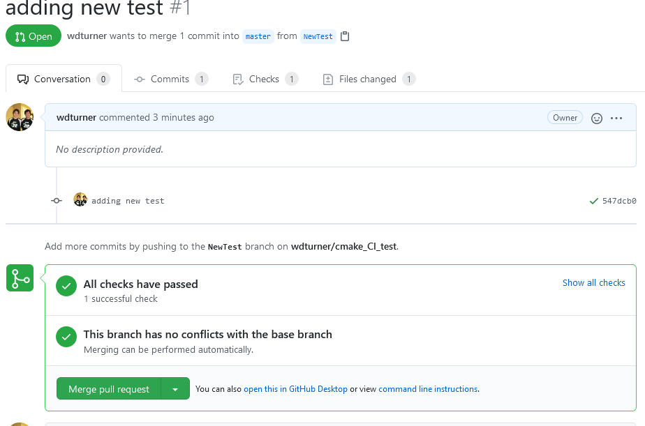
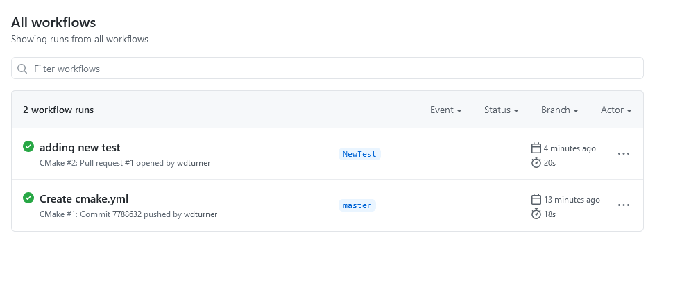

# Lab 8: Testing and Continuous Integration

Testing is the life blood of any large project and a comprehensive
suite of unit and regression tests can greatly improve the lives of both developers and users. For developers:

1. It allows them to have high confidence that any changes they introduce into the system does not adversely impact other code -- particularly code that may not be frequently executed -- in an unexpected way
2. It gives developers an established way to track down and correct systemic errors
3. It provides an easy way to verify correctness when porting to new computer architectures
4. It provides a baseline target when refactoring the code.

For users:

1. It provides a high confidence that the given code works and has been installed correctly on the user's system
2. It provides examples for how the code can be used correctly

This final point is further improved when integration tests or examples are included in the testing environment.

For this lab, we will revisit the material from our section on build systems. We will use some of the same tools to execute and verify unit tests on an established project, *CMake*, demonstrate how to add a _(non-working)_ test to the system, and then how to iterate on the test until we have it working correctly.

*If it ain't tested, it's broken -- Bill Lorensen and the VCV Board, GE Global Research*

Record all of your observations and a reasonably comprehensive set of screen shots in your lab report for *lab8*.

## Checkpoint 1: Getting Started
1. You should already have *cMake* installed from our unit on build systems. If not, please visit [https://cmake.org/download/](https://cmake.org/download/) to download and install it for your operating system.
2. Now visit the CMake repository GitLab [https://gitlab.kitware.com/cmake/cmake](https://gitlab.kitware.com/cmake/cmake) and clone CMake.
3. Create a build directory and use *cmake-gui* to bring up the configuration options for cmake. Point the source and build directories appropriately for where you installed the CMake clone and the build directory you create. Hit _configure_ to allow cmake to set up the build files for your system. Choose to build _unix makefiles_ as the generator if you are on Linux or OSX (_ninja should work as well_). Choose the appropriate version of VS if you are on Windows.
5. leave all the options as they are originally.
5. Hit *configure* and then *generate* to complete generating the build system
6. If you are using WSL and get an error about missing **OpenGL** dependencies, install OpenGL using:
    -  sudo apt-get update
    -  sudo apt-get install libglu1-mesa-dev freeglut3-dev mesa-common-dev
7. **Add a screenshot of the *cmake-gui* screen to your lab report.**

## Checkpoint 2: Executing the Tests
1. Now we will use *ctest* to build and test the system. We will be doing an *Experimental* build to differentiate ourselves from *validated* systems; and in the interests of time, we will only run a subset of the normal CMake testing. In the Build directory, execute the command `ctest -D Experimental -I 11,26`. Experimental builds start from your current project state, execute a configure command to pull in any changes you may have made to the CMake Files, build the system to pull in any code changes and then execute a suite of tests and report back to the dashboard. The `-I` option allows us to specify a subset of tests (in this case tests 11 through 26) to be executed. Since we just did a configure, the configure phase should be relatively small, although, setting up the test configuration the first time does require a little build time. The build phase will take a little longer. After this time building all of *cmake*, most of the time will actually be spent running **CMake** tests. Ignore any errors with coverage. We may have to install a few more tools to get that completely operational on your systems.
1. While the system is building, visit the CMake dashboard at [https://open.cdash.org/index.php?project=CMake](https://open.cdash.org/index.php?project=CMake). Explore the project. **Add answers to these questions in your lab Lab notebook.**
	- Find the *Nightly* and *Experimental* sections and look at some of the submissions. How can you see what tests were run for a particular submission?
	- Find a submission with errors. Can you see what the error condition was? How does this help you debug the failure?
	- Find a system that is close to your specific configuration in the *Nightly*, *Nightly Expected* or one of the *Masters* sections. How _clean_ is the dashboard? Are there any errors that you need to be concerned with?
3. Go back to the dashboard and find your submission. Are there any errors? If so, are they consistent with other projects using your architecture? If not, fix any significant errors in your system and resubmit to the dashboard until your system performs similarly to equivalent architectures. Note, that when the website is hit a lot there may be issues with your specific submission showing up.
4. **Add a screenshot of your test submission in the Experimental Dashboard or from the command window to your lab report.**

## Checkpoint 3: Failing/Passing a Test
1. Take a look at the file [Kitware-modded-Copyright.txt](Kitware-modded-Copyright.txt). We will use this file to demonstrate the testing. It is a bit of a cheat because when it fails, you can use a simple file diff to figure out the error, but it should still be a good demonstration.
2. Copy this file overtop of the existing ***Copyright.txt*** file in the CMake clone.
3. Re-execute the testing. You can use our original command, `ctest -D Experimental -I 11,26` or you can skip sending the results to the dashboard by entering `ctest -I 11,26` or `ctest -I 11,26 -VV`. These will run somewhat faster. Explore and make sure that you can identify the error. What information does the failure provide? What does `-VV` do? You can look at the test results or drill down on the dashboard if you submitted it there.
4. **Add a screenshot of your test submission with errors in the Experimental Dashboard or from the command window to your lab report.**
5. **Now use what you learned to fix the error. Grab a screenshot to document the fix and the successful run.**

## Checkpoint 4: CI/CD
Finally, we are going to use a simpler example to set up a CMake CI test on Github.

1. Copy the CMake Step 5 example you generated in the **Build Module** to a "clean" directory outside of the CMake repository and create a new git repository with just that tutorial code in it. Make sure that you add a README with the details of its origin.
2. Verify that your tests still execute.
2. Push this to a new repository on Github.
3. Set up a github action to run your tests for pushes and for pull requests. **Note that there is a CMake template in the CI/CD section.** You can access it by going to the *Actions* tab and creating a new workflow. You do not need to write a lot of code if you use the template. You may want to check the specification of when the action is supposed to run. Verify that the action runs and you pass all the tests when you commit the action to the repository.
4. Create a new branch on your local repository and add a test for the square root of 4096. Push the new branch and create a pull request for it.
5. Verify that your tests run automatically on creating the pull request and give you no errors. Fix them if necessary.
6. **Put a link to your repository on github in your Lab report along with screenshots of your pull request after the actions execute successfully, and at least one successful push execution. Screenshots from my run are at the bottom of this file for reference.**

***When you are finished, push your Lab 8 report to your Lab Folder in your repository and fill out your repository information on Submitty to submit.***

## Checkpoint 5: Project Updates
For the rest of the semester you will be expected to do a short blog on your project progress each week, or really anything interesting you find in the the open source world. This will be written as wiki entries in your lab repository. Go to your lab repository on GitHub. If you don't see a **wiki** tab, you will need to enable it using the settings tab. Write your first blog as a paragraph description of the status of your project - What did you do last week on your project? You only have 5 more weeks to finish.

## Example Illustrations

