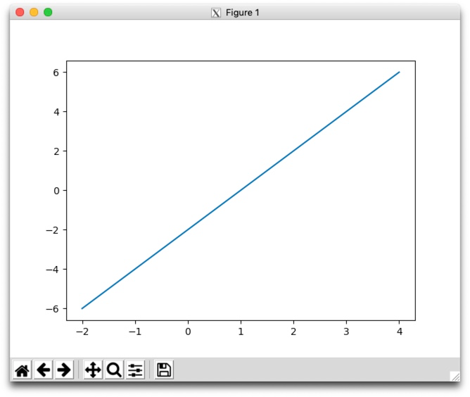
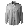

# TensorFlow Lab
### 4/12/2019

## Checkpoint 1: Verify Your TensorFlow

For the first checkpoint of this lab, we'll work on just getting a proper installation of the tools we will need to use. Most of them can be installed using the python pip utility, with the possible exception of `python-tk`. 

I am going to give you leeway to use whatever tools you want for this lab. Feel free to use the tensor flow container I used during lecture, or a native install to your local version of python. You can also use Google's colab; although, you will not be able to connect to it to check your work during the exam. Note that if you are using the docker container, it will help for checkpoint 3 if you map a local directory into your container.

Regardless, you will need access to the python packages **tensorflow, keras, matplotlib and numpy, and probably pillow**. Install them (you can probably use pip or conda depending on your `python` install). Once you are done, start `python` and run:

```
from __future__ import absolute_import, division, print_function

# TensorFlow and tf.keras
import tensorflow as tf
from tensorflow import keras
from PIL import Image
from PIL import ImageOps

# Helper libraries
import numpy as np
import matplotlib.pyplot as plt

print(tf.__version__)
plt.plot((-2,4),(-6,6))
plt.show()
```
This should print out a version of TensorFlow in the console window and pop up a window:



Take a screenshot of your pop-up and include it in your lab notebook.

When you are finished exit python and restart it to clear your work.

## Checkpoint 2: Run a TensorFlow classification

Next go to [https://www.tensorflow.org/tutorials/keras/basic_classification](https://www.tensorflow.org/tutorials/keras/basic_classification)
and run through the fashion classification example. 

When you are done, modify the code block below to print out the information for
the 15 images from 9000-9014 instead of for images 0-11:

```
# Plot the first X test images, their predicted label, and the true label
# Color correct predictions in blue, incorrect predictions in red
num_rows = 5
num_cols = 3
num_images = num_rows*num_cols
plt.figure(figsize=(2*2*num_cols, 2*num_rows))
for i in range(num_images):
  plt.subplot(num_rows, 2*num_cols, 2*i+1)
  plot_image(i, predictions, test_labels, test_images)
  plt.subplot(num_rows, 2*num_cols, 2*i+2)
  plot_value_array(i, predictions, test_labels)
plt.show()
```

**Grab a screenshot of this plot and include it in your lab notebook.**

## Checkpoint 3: Curate some data

Browse the web, or take a picture to find at least 3 images of clothing, shoes, bags etc. The Google speakers assured us that obtaining and curating the data
would be the hard part. We are going to see if they were correct. Take your images, process them to get them in the correct form for the model (greyscale, 28x28 pixels - make sure you use cropping to get your image square before resizing it and make sure you invert the colors so that white is 0) and then pass it into the classification model you generated. The Image and ImageOps modules from pillow will be very useful for this.

The following links may help you:

[https://pillow.readthedocs.io/en/stable/](https://pillow.readthedocs.io/en/stable/)

[https://kite.com/python/examples/4887/pil-convert-between-a-pil-%60image%60-and-a-numpy-%60array%60](https://kite.com/python/examples/4887/pil-convert-between-a-pil-%60image%60-and-a-numpy-%60array%60)

**Include your original image, your greyscale 28x28 pixel image, and the results of your classification in your lab notebook.**

Here are my first three attempts:


```
[[1.4762013e-02 2.2030171e-04 5.1683296e-02 2.0069817e-02 6.9348738e-02
  1.3521332e-02 7.6108474e-01 1.0612813e-03 6.6945553e-02 1.3029455e-03]] 6 Shirt
```




```
[[3.5796508e-03 1.3106716e-05 3.2439572e-01 2.3899054e-02 4.4865412e-01
  8.4455935e-03 1.8258789e-01 6.8158122e-05 8.3385631e-03 1.8128438e-05]] 4 Coat
```


```
[[2.5140275e-06 3.3653549e-11 1.4402343e-04 5.7210900e-06 2.7189176e-03
  5.5948669e-07 9.9712771e-01 2.7641710e-11 4.2381637e-07 1.2968426e-09]] 6 Shirt
```
2 out of 3 isn't bad ...

**When you are finished, push your report to your lab notebook and submit a text file with a link to the lab report to Submitty.**


