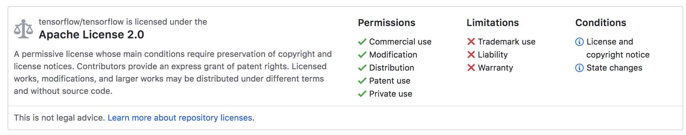
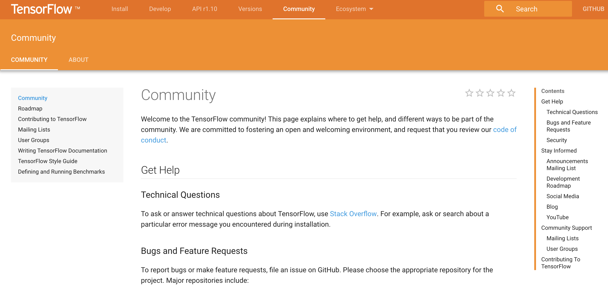
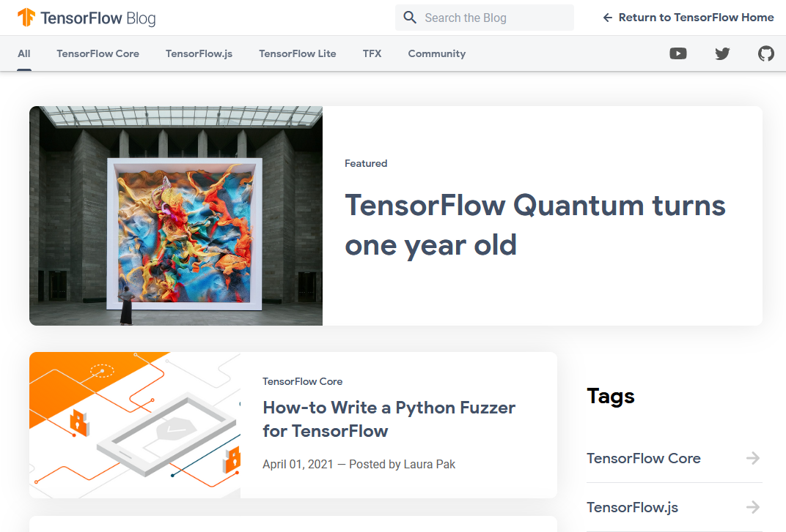
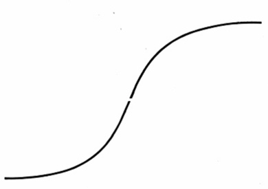
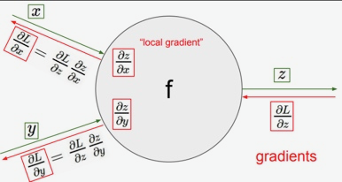
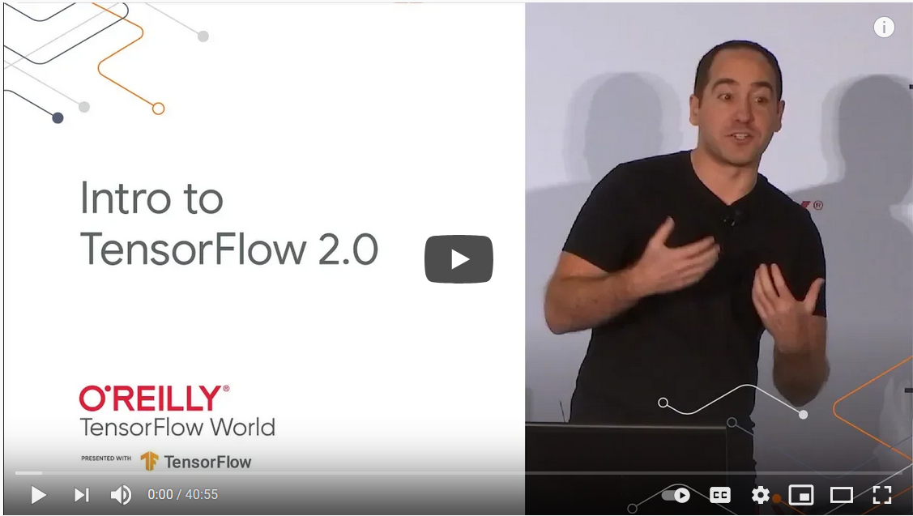

TensorFlow Tutorial
###################

Open Source Software

Wesley Turner

Rensselaer Polytechnic Institute

Department of Computer Science

Some material adapted from Olivier Poulin

.. nextslide::

Licensed under: CC-BY-SA 4.0 https://creativecommons.org/licenses/by-sa/4.0/

Reading Material
################

* TensorFlow Guide - (Reference Only)
    * https://www.tensorflow.org/guide

      * Read TensorFlow Basics through "Training Loops"
      * Keras through "Training and evaluation ..."

Introduction
============

What is TensorFlow?
-------------------

.. pull-quote:: TensorFlow is an end-to-end open source platform for machine learning ... that lets researchers push the state-of-the-art in ML and developers easily build and deploy ML powered applications.  [1]_

.. [1] https://www.tensorflow.org/

.. nextslide::

TensorFlow™ is:

* Open source 
  
* High performance numerical computation
  
* Deploys on  CPUs, GPUs, TPU
  
* Desktops, clusters, mobile and edge devices
 
* Originally developed by Google Brain team within Google’s AI organization
  
.. nextslide::

TensorFlow™ has:

* Strong support for machine learning 
  
* Strong support for deep learning
 
* Flexible numerical computation core

Widely Used
-----------

Companies:

.. image:: static/Companies1.png

.. nextslide::

Companies (continued):

.. nextslide::

Companies (continued):

.. image:: static/Companies3.png

By the Numbers
--------------

Github page: https://github.com/tensorflow

.. image:: static/github1.png

.. nextslide::

Main repository: https://github.com/tensorflow/tensorflow

* 53,075 commits (now 127,381)

* 27 branches (now 47)

* 1932 contributers (now 3099)

* 79 releases (now 158)

* 2021 Issues (now 2288 - closed 32,098)

* Permissively licensed under Apache-2.0

.. nextslide::

Active community
----------------

* Community overview: https://www.tensorflow.org/community/

.. nextslide::

* Insights at: https://github.com/tensorflow/tensorflow/graphs/contributors

.. image:: static/github2.png

.. nextslide::

* Blog: https://blog.tensorflow.org/

.. nextslide::

* Issue Tracker: https://github.com/tensorflow/tensorflow/issues

.. image:: static/Issues.png

.. nextslide::

* Questions: https://stackoverflow.com/questions/tagged/tensorflow

.. image:: static/StackOverflow.png

.. nextslide::

Others:

* Twitter

* YouTube

* Release Notes

The Basics
==========

Much of this section courtesy of Olivier Poulin, one of our previous mentors.

Multiple Installations
----------------------

* Virtualenv
 
* "native" pip

* Docker

* Source

.. nextslide::

For this class, we will use the Docker installation:

.. code-block:: console

  $ docker run -it -p 8888:8888 tensorflow/tensorflow
  Unable to find image 'tensorflow/tensorflow:latest-devel' locally
  latest-devel: Pulling from tensorflow/tensorflow
  8ee29e426c26: Pull complete 
  ...
  9c2312dbc5d7: Pull complete 
  Digest: sha256:40844012558fe881ec58faf1627fd4bb3f64fe9d46a2fd8af70f139244cfb538
  Status: Downloaded newer image for tensorflow/tensorflow:latest
  
  ________                               _______________                
  ___  __/__________________________________  ____/__  /________      __
  __  /  _  _ \_  __ \_  ___/  __ \_  ___/_  /_   __  /_  __ \_ | /| / /
  _  /   /  __/  / / /(__  )/ /_/ /  /   _  __/   _  / / /_/ /_ |/ |/ / 
  /_/    \___//_/ /_//____/ \____//_/    /_/      /_/  \____/____/|__/

.. nextslide::

Docker:

* Runs a TensorFLow Container

  * Bindings to Python

* Maps port 8888 on the Container to port 8888 outside the container

  * Allows you to run Jupyter Notebooks

* Starts up an interactive session

Validate
--------

From the Docker container:

.. code-block:: console

  # python
  Python 2.7.12 (default, Dec  4 2017, 14:50:18) 
  [GCC 5.4.0 20160609] on linux2
  Type "help", "copyright", "credits" or "license" for more information.

.. code-block:: python

  >>> import tensorflow as tf
  >>> a = tf.constant(3)
  >>> a
  <tf.Tensor: shape=(), dtype=int32, numpy=3>
  >>> b = tf.constant(5)
  >>> c = a + b
  >>> c
  <tf.Tensor: shape=(), dtype=int32, numpy=8>
  >>> print(c)
  tf.Tensor(8, shape=(), dtype=int32)

What does TensorFlow do?
------------------------

* Similar to Numpy, for n-dimensional arrays, but TensorFlow simplifies creation of tensor methods and computes derivatives.

+----------------------------------------+----------------------------------------+
| Numpy                                  | TensorFlow                             |
+========================================+========================================+
| a=np.zeros((2,2)); b=np.ones((2,2))    | a=tf.zeros((2,2)); b=tf.ones((2,2))    |
+----------------------------------------+----------------------------------------+
| np.sum(b,axis=1)                       | tf.reduce_sum(b,axis=[1])              |
+----------------------------------------+----------------------------------------+
| a.shape                                | a.get_shape()                          |
+----------------------------------------+----------------------------------------+
| np.reshape(a, (1,4))                   | tf.reshape(a, (1,4))                   |
+----------------------------------------+----------------------------------------+
| b * 5 + 1                              | b * 5 + 1                              |
+----------------------------------------+----------------------------------------+
| np.dot(a, b)                           | tf.matmul(a, b)                        |
+----------------------------------------+----------------------------------------+
| a[0,0], a[:,0], a[0,:]                 | a[0,0], a[:,0], a[0,:]                 |
+----------------------------------------+----------------------------------------+

Base usage involves making execution graph
------------------------------------------
* TensorFlow uses a computation graph that has no numerical value until it’s evaluated.
* Program structure has two phases: Construction phase and Execution phase.
* Construction phase assembles the computation graph. 
* Execution phase runs the session object to execute all the operations in the graph.

.. image:: static/ex_graph.png

.. nextslide::

Base usage involves making execution graph
------------------------------------------
* Okay forget that ...
* This was Tensorflow 1.0
* In Tensorflow 2.0, the graph still exists but you can ignore it ...

What is Deep Learning?
----------------------
* Deep learning is a machine learning method.
* More complex but has broader applications than classic task-specific algorithms.
* It bases the construction of its models on networks observed in biological nervous systems.
* Train Artificial Neural Networks to transform an input into a desired output. 

Neural Network
--------------
* A collection of units or nodes (artificial neurons, hence neural network)
* Connected in layers to one another. Each node sends data to other nodes
* Train the “weights” and “biases” on each neuron to slowly inch the network towards a specific functionality.

.. image:: static/Neural_Net.png

Simplest artificial neural network (ANN): Perceptron
----------------------------------------------------

* Only binary inputs/outputs
* Binary output means the signals between neurons can only be binary as well
* Something either is, or isn’t
* Limited in its functionality

.. image:: static/perceptron.png

Sigmoid Neurons
---------------

* Inputs/outputs are any values between 0 and 1
* Gives us much more nuanced outputs
* Can be used for % matches

.. image:: static/formula.png

Deep Learning uses multiple layered networks
--------------------------------------------

.. image:: static/deep.png

How to train your dragon (network)
----------------------------------

* Compare the output with training data
* Get a vector of all the errors and compute the downward slope of the error curve (derivative)
* Change the weights based on this “Gradient Descent”
* Complicated in huge networks

A simple linear example
-----------------------

* Simplifies everything!
* Example:  A simple linear regression!
* Linear function y = ab+c
* How do we train a simple network to mimic a linear function?
* Where bias = 1. This function becomes y = xw2 + w1

.. image:: static/simple.png

Get set up
----------

For OSX, you will need to install a few packages on the host first to get the plots at the end to work:

.. code-block:: console

  brew install socat
  socat TCP-LISTEN:6000,reuseaddr,fork UNIX-CLIENT:\"$DISPLAY\" &
  brew install --cask xquartz
  open -a Xquartz

  Then set Allow connections from network clients in the pop up if asked.

.. nextslide::

Run a docker container and update it

.. code-block:: console

  docker run -it -p 8888:8888 -e "DISPLAY"=host.docker.internal:0 \
    tensorflow/tensorflow:latest
  apt-get update
  apt-get install python-tk xterm x11-apps qt5-default
  xeyes & # Just a test to make sure our display is working
  pip install matplotlib PyQt5

or use your own python installation

.. code-block:: console

  pip install tensorflow matplotlib PyQt5

Run a simple example
--------------------

Imports:

.. code-block:: python

  import tensorflow as tf
  from tensorflow.keras import Model
  import matplotlib.pyplot as plt

.. nextslide::

Let's define some utilities:

.. code-block:: python

  def make_noisy_data(m=0.1, b=0.3, n=100):
    x = tf.random.uniform(shape=(n,))
    noise = tf.random.normal(shape=(len(x),), stddev=0.01)
    y = m * x + b + noise
    return x, y

  def predict(x):
    y = m * x + b
    return y

  def squared_error(y_pred, y_true):
    return tf.reduce_mean(tf.square(y_pred - y_true))

.. nextslide::

Set up the data:

.. code-block:: python

  x_train, y_train = make_noisy_data()
  plt.plot(x_train, y_train, 'b.')
  plt.show()

  m = tf.Variable(0.)
  b = tf.Variable(0.)

  loss = squared_error(predict(x_train), y_train)
  loss_vec = []
  print("Starting loss {:.6f}".format(loss.numpy()))

.. nextslide::

Training parameters:

.. code-block:: python

  learning_rate = 0.05
  steps = 200

.. nextslide::

Execute the gradient descent:

.. code-block:: python

  for i in range(steps):

    with tf.GradientTape() as tape:
        predictions = predict(x_train)
        loss = squared_error(predictions, y_train)

    loss_vec.append(loss)
    gradients = tape.gradient(loss, [m, b])

    m.assign_sub(gradients[0] * learning_rate)
    b.assign_sub(gradients[1] * learning_rate)

    
    if i % 20 == 0:
        print("Step {:d}, Loss {:.6f}".format(i, loss.numpy()))

.. nextslide::

Report:

.. code-block:: python

  print("Solution: y = {:.6f} * x + {:.6f}".format(m.numpy(), b.numpy()))
  plt.plot(list(range(steps)), loss_vec)
  plt.show()

  plt.plot(x_train, y_train, 'b.')
  plt.plot(x_train, predict(x_train))
  plt.show()

.. nextslide::

Using TensorFlow
================

Tutorial
--------

Of course, Google has us covered:
https://www.youtube.com/watch?v=5ECD8J3dvDQ

.. nextslide::

Website from the video:
https://github.com/tensorflow/workshops

.. image:: static/Workshop.png

.. nextslide::

Other links:

* Cats versus Dogs (longer version) https://bit.ly/2G0bWNe

* https://colab.research.google.com/

* https://js.tensorflow.org/

* https://ai.google/education/

