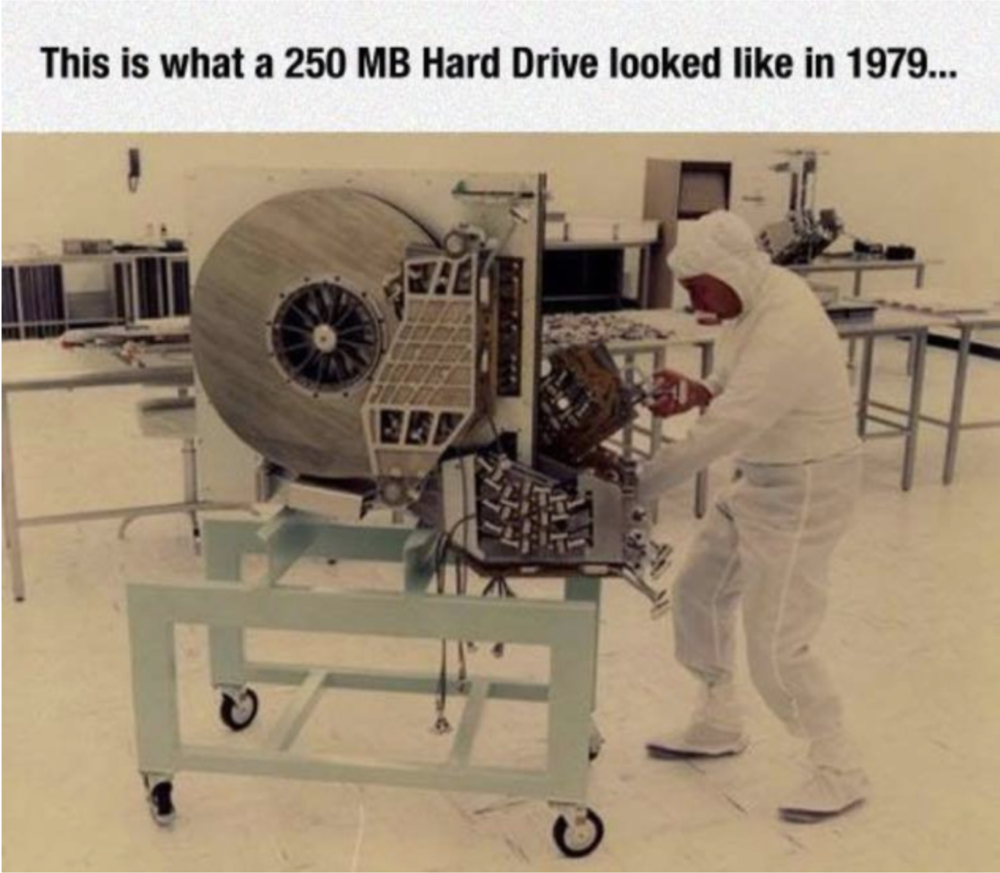
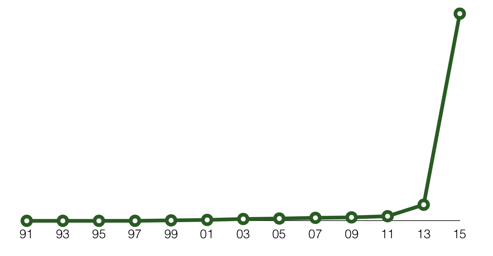
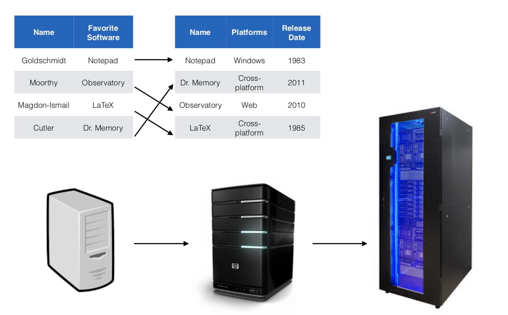
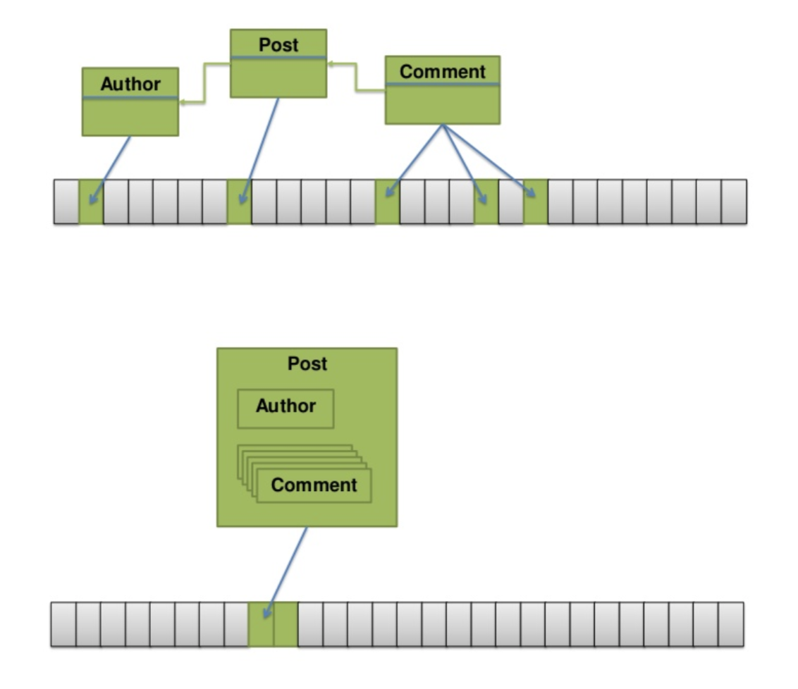
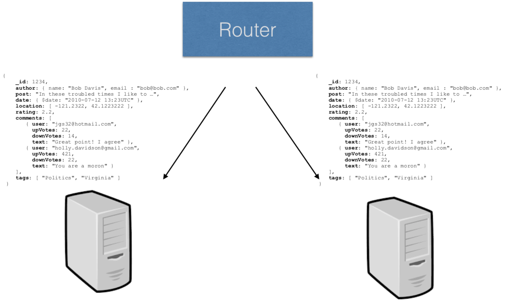
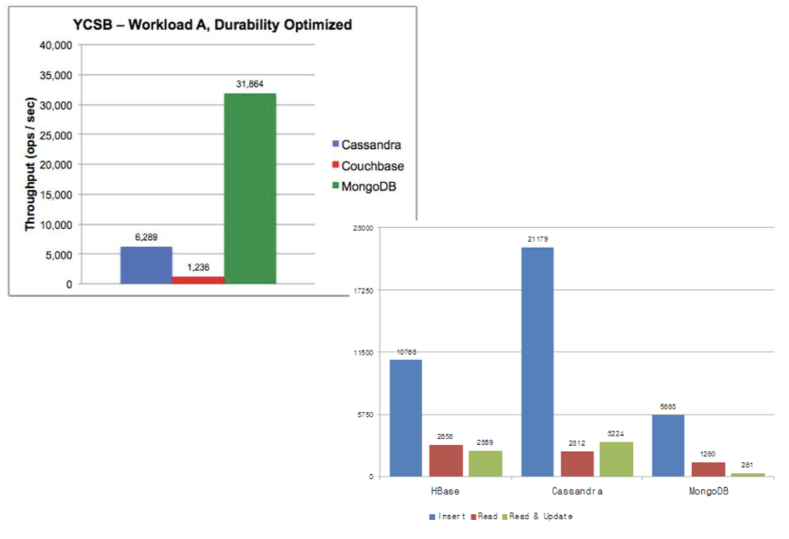
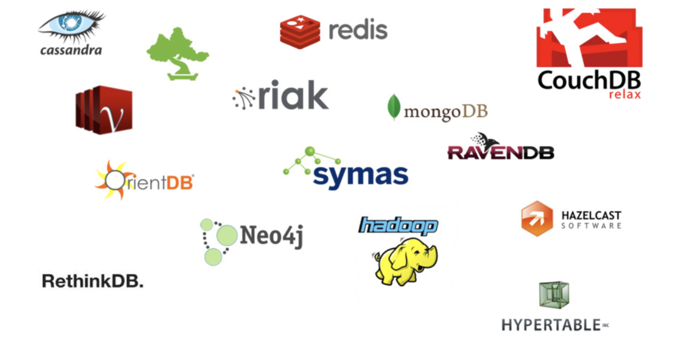
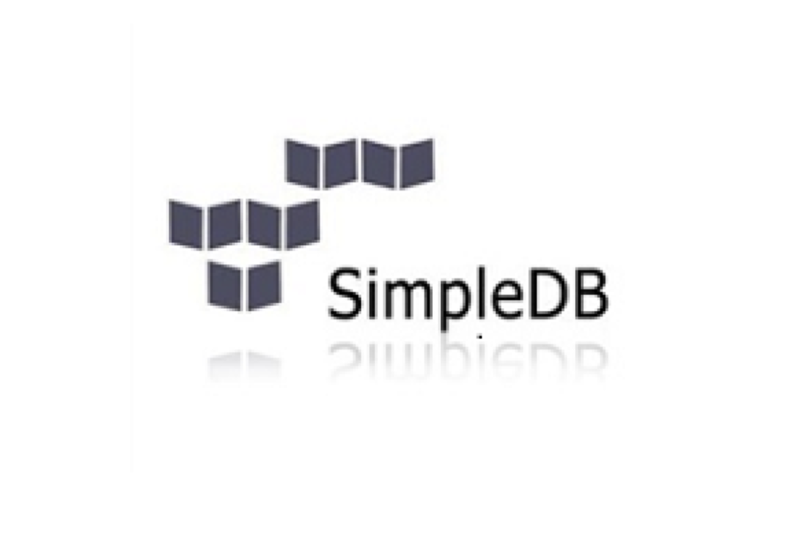
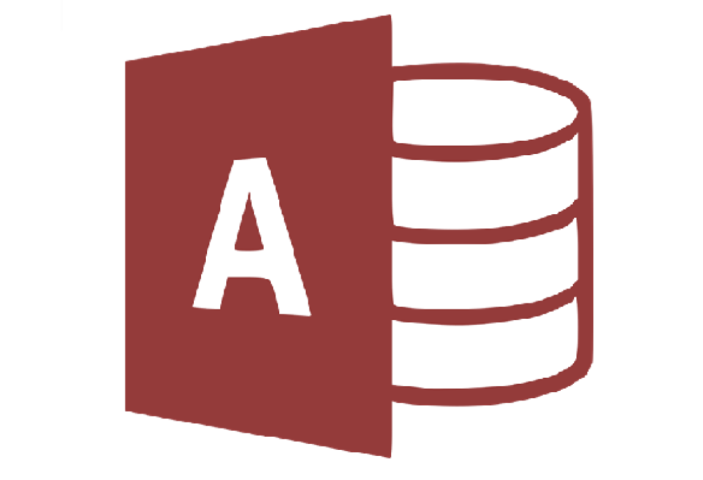

Databases
#########

Open Source Software

Wesley Turner

Rensselaer Polytechnic Institute

Department of Computer Science

.. nextslide::

Licensed under: CC-BY-SA 4.0 https://creativecommons.org/licenses/by-sa/4.0/

.. nextslide::

Uses material from: 

* https://github.com/rcos/CSCI2963-01-Spring2017/blob/master/Lectures/MongoDB.pdf
  
    * Thanks: Raymond Jacobson, Class of 2016 CS/CSE!

* https://www.tutorialspoint.com/mongodb

Reading Material
################

* MongoDB Manual
    * https://docs.mongodb.com/manual/
    * Read up through *MongoDB CRUD Operations*, especially **Introdution** and **SQL to MongoDB Mapping Chart**

Introduction
============

What is a Database?
-------------------

.. pull-quote:: A database is an organized collection of data, generally stored and accessed electronically from a computer system. Where databases are more complex they are often developed using formal design and modeling techniques. [1]_ 

.. [1] Read https://en.wikipedia.org/wiki/Database

.. nextslide::

But people have always used databases
-------------------------------------

.. image:: static/building1.png

.. nextslide::

.. image:: static/building2.png

.. nextslide::

.. image:: static/building3.png

.. nextslide::

Store Information
-----------------

.. image:: static/storage.png
   :scale: 40 %
   :align: center 

.. .. nextslide::

.. We will consider two main types:

.. * Virtual Machines

  * Software to allow a piece of hardware to run multiple operating system images at the same time

  * Eg. *VirtualBox*

.. * Containers

  * A lightweight, stand-alone, executable package of a piece of software that includes everything needed to run it

  * Eg. *Docker*

Through the Decades
===================

1970s
=====

The Relational Database
-----------------------

+-------------+-------------------+---+-------------+----------+--------------+
|     Professors                  |   | Software                              |
+-------------+-------------------+---+-------------+----------+--------------+
| Name        | Favorite Software |   | Name        | Platforms| Release Date |
+=============+===================+===+=============+==========+==============+
| Goldschmidt | Notepad           |   | Notepad     | Windows  | 1983         |
+-------------+-------------------+---+-------------+----------+--------------+
| Moorthy     | Observatory       |   | Dr. Memory  | Cross-   | 2011         |
|             |                   |   |             | Platform |              |
+-------------+-------------------+---+-------------+----------+--------------+
| Magdon-     | Latex             |   | Observatory | Web      | 2010         |
| Ismail      |                   |   |             |          |              |
+-------------+-------------------+---+-------------+----------+--------------+
| Cutler      | Dr. Memory        |   | LaTeX       | Cross-   | 1985         |
|             |                   |   |             | Platform |              |
+-------------+-------------------+---+-------------+----------+--------------+

.. nextslide::

.. code-block:: console

  > SELECT FAVORITE_SOFTWARE FROM PROFESSORS WHERE NAME='Moorthy'

  >> "Observatory"

.. nextslide::

Joins
-----

+-------------+-------------------+---+-------------+--------------+----------------+
|     Professors                  |   | Software                                    |
+-------------+-------------------+---+-------------+--------------+----------------+
| Name        | Favorite Software |   | Name        | Platforms    | Release Date   |
+=============+===================+===+=============+==============+================+
| Goldschmidt | Notepad           |   | Notepad     | Windows      | 1983           |
+-------------+-------------------+---+-------------+--------------+----------------+
| Moorthy     | Observatory       |   | Dr. Memory  | **Cross-**   | 2011           |
|             |                   |   |             | **Platform** |                |
+-------------+-------------------+---+-------------+--------------+----------------+
| Magdon-     | Latex             |   | Observatory | Web          | 2010           |
| Ismail      |                   |   |             |              |                |
+-------------+-------------------+---+-------------+--------------+----------------+
| Cutler      | Dr. Memory        |   | LaTeX       | **Cross-**   | 1985           |
|             |                   |   |             | **Platform** |                |
+-------------+-------------------+---+-------------+--------------+----------------+

.. code-block:: console

  > SELECT PROFESSORS.NAME FROM PROFESSORS JOIN SOFTWARE ON \
  PROFESSORS.FAVORITE_SOFTWARE=SOFTWARE.NAME WHERE \
  SOFTWARE.PLATFORMS=“Cross-platform”
  >> “Magdon-Ismail”, “Cutler”

.. nextslide::

+---------------+-------------+----------------+--------------+
| Name          | Favorite    | Platforms      | Release Date |
|               | Software    |                |              |
+===============+=============+================+==============+
| Goldschmidt   | Notepad     | Windows        | 1983         |
+---------------+-------------+----------------+--------------+
| Moorthy       | Observatory | Web            | 2010         |
+---------------+-------------+----------------+--------------+
| Magdon-Ismail | LaTeX       | Cross-platform | 1985         |
+---------------+-------------+----------------+--------------+
| Cutler        | Dr. Memory  | Cross-platform | 2011         |
+---------------+-------------+----------------+--------------+

.. code-block:: console

  > SELECT PROFESSORS.NAME FROM PROFESSORS JOIN SOFTWARE ON \
  PROFESSORS.FAVORITE_SOFTWARE=SOFTWARE.NAME WHERE \
  SOFTWARE.PLATFORMS=“Cross-platform”
  >> “Magdon-Ismail”, “Cutler”

1970s/80s/90s
=============

1970s/80s/90s
-------------

- Keep things separate (normalize) 
  
- No redundant data 
  
- Seems pretty sensible

.. nextslide::

- Keep things separate (normalize) 
  
- No redundant data 
  
- Seems pretty sensible

- Still widely used today in many applications

.. image:: static/cathy.jpg
   :scale: 20 %
   :align: center 

.. nextslide::

+----------------------+-------------------------------------+-----------------+
| Name                 | Developers/Owner                    | Initial Version |
+======================+=====================================+=================+
| OracleDB             | Oracle                              | 1978            |
+----------------------+-------------------------------------+-----------------+
| DB2                  | IBM                                 | 1983            |
+----------------------+-------------------------------------+-----------------+
| MySQL                | Oracle                              | 1995            |
+----------------------+-------------------------------------+-----------------+
| Microsoft SQL Server | Microsoft                           | 1989            |
+----------------------+-------------------------------------+-----------------+
| PostgreSQL           | PostgreSQL Global Development Group | 1996            |
+----------------------+-------------------------------------+-----------------+
| Sybase               | SAP                                 | 1987            |
+----------------------+-------------------------------------+-----------------+

The World Then
--------------

The World Now
-------------

.. image:: static/newHD.png
   :scale: 50 %
   :align: center 

The World Then
--------------

.. image:: static/oldPeople.png
   :scale: 40 %
   :align: center 

The World Now
-------------

But Really
----------

.. image:: static/morePeople.png
   :scale: 40 %
   :align: center

.. nextslide::

As of 2015, a full 90 percent of all the data in the world has been generated over the previous two years

Vertical Scalability
--------------------

Horizontal Scalability
----------------------

Which professors like software that runs on Windows?

.. image:: static/hScale.png
   :scale: 55 %
   :align: center

Normalization
-------------

.. image:: static/schema.png
   :scale: 50 %
   :align: center

.. nextslide::

.. code-block:: console

  class AudioDevice:
      def __init__(self, manufacturer, device):
          self.manufacturer = manufacturer
          self.device = device
        
  class MP3Player(AudioDevice):
      def __init__(self, manufacturer, device, file_format):
          AudioDevice.__init__(self, manufacturer, device)
          self.file_format = file_format
    
  class RecordPlayer(AudioDevice):
      def __init__(self, manufacturer, device, speed):
          AudioDevice.__init__(self, manufacturer, device)
          self.speed = speed

.. nextslide::

+-----------+--------------+-------------+--------+
| Device    | Manufacturer | File Format | Speed  |
+===========+==============+=============+========+
| iPod      | Apple        | .m4a        | :-(    |
+-----------+--------------+-------------+--------+
| Turntable | Pro-Ject     | :-(         | 33 rpm |
+-----------+--------------+-------------+--------+
| Zune      | Microsoft    | .wma        | :-(    |
+-----------+--------------+-------------+--------+

.. nextslide::

+-----------+--------------+-------------+
| Device    | Manufacturer | File Format |
+===========+==============+=============+
| iPod      | Apple        | .m4a        |
+-----------+--------------+-------------+
| Zune      | Microsoft    | .wma        |
+-----------+--------------+-------------+

+-----------+--------------+-------------+
| Device    | Manufacturer | Speed       |
+===========+==============+=============+
| Turntable | Pro-Ject     | 33 rpm      |
+-----------+--------------+-------------+

.. nextslide::

+-----------+--------------+
| Device    | File Format  |
+===========+==============+
| iPod      | .m4a         |
+-----------+--------------+
| Zune      | .wma         |
+-----------+--------------+

+-----------+--------------+
| Device    | Speed        |
+===========+==============+
| Turntable | 33 rpm       |
+-----------+--------------+

+-----------+--------------+
| Device    | Manufacturer |
+===========+==============+
| iPod      | Apple        |
+-----------+--------------+
| Turntable | Pro-Ject     |
+-----------+--------------+
| Zune      | Microsoft    |
+-----------+--------------+

So ... What is MongoDB?
=======================

Schema
------

.. image:: static/schemaSmall.png
   :scale: 50 %
   :align: center

MongoDB is a Document Database
------------------------------

.. code-block:: console

  { _id: 1234,
  author: { name: "Bob Davis", email : "bob@bob.com" }, 
  post: "In these troubled times I like to ...",
  date: { $date: "2010-07-12 13:23UTC" },
  location: [ -121.2322, 42.1223222 ],
  rating: 2.2, comments: [
    { user: "jgs32@hotmail.com", upVotes: 22,
      downVotes: 14,
      text: "Great point! I agree" },
    { user: "holly.davidson@gmail.com", upVotes: 421,
      downVotes: 22,
      text: "You are a moron" } ],
  tags: [ "Politics", "Virginia" ] 
  }

Actually, BSON (Binary JSON) http://bsonspec.org/

Normalization vs. Document Store
--------------------------------

Horizontal Scalability
----------------------

.. nextslide::

.. image:: static/performance.png
   :scale: 65 %
   :align: center

.. nextslide::

Flexible Schema
---------------

+---------------------------------------------------------+----------------------------------+
| Relational                                              | DB MongoDB                       |
+=========================================================+==================================+
| 1. Set up schema                                        | 1. Insert data                   |
+---------------------------------------------------------+----------------------------------+
| 2. Insert data                                          | 2. Insert data with new structure|
+---------------------------------------------------------+----------------------------------+
| 3. Change schema                                        | 3. Insert data with new structure|
+---------------------------------------------------------+----------------------------------+
| 4. Insert data with new structure                       |                                  |
+---------------------------------------------------------+----------------------------------+
| 5. How do I change the schema? Am I breaking something? |                                  |
+---------------------------------------------------------+----------------------------------+
| 6. Insert data with new structure                       |                                  |
+---------------------------------------------------------+----------------------------------+

Problems with Flexible
----------------------

.. code-block:: console

  {
    _id: 1,
    author: { name: "Bob Davis", email : "bob@bob.com" }, 
    post: "In these troubled times I like to ...",
    date: { $date: "2010-07-12 13:23UTC" },
  } 
  {
    _id: 1928571982758,
    author: { name: “Peter Brown", email : “brownp@rpi.edu” }, 
    post: “First blog post ever",
    date: { $date: "2014-11-12 13:23UTC" },
    tags: [ "Food", “DIY" ]
  }

Why is MongoDB Open Source?
---------------------------

#. Community 

#. Documentation 

#. Ease of adoption 

#. Trust in open source

Why is MongoDB Open Source?
---------------------------

#. Community 

#. Documentation 

#. Ease of adoption 

#. Trust in open source

**What Happened?**

Databases are an Unsolved Problem
---------------------------------

- Scalability
- Fault tolerance/Availability Consistency
- Speed

.. image:: static/problem.png
   :scale: 60 %
   :align: center

Other Options
-------------

Database Top 10
===============

https://www.databasejournal.com/features/oracle/slideshows/top-10-2019-databases.html

Database Top 10
---------------

.. image:: static/db1.png
   :scale: 30 %
   :align: center

A The first commercially available SQL-based Relational Database Management System was released by Oracle in 1979. Oracle provides a range of industry-leading on-premises and cloud-based database solutions to meet the data management requirements from small businesses to large enterprises.

.. nextslide::

.. image:: static/db2.png
   :scale: 30 %
   :align: center

MySQL is the most popular Open Source SQL Database Management System (DBMS). MySQL databases are relational which stores data in separate organized tables. MySQL is Open Source which means that it is possible for anyone to use and modify the software. Anybody may download MySQL from the Internet and use it without paying a cent.

.. nextslide::

.. image:: static/db3.png
   :scale: 30 %
   :align: center

Security innovations in Microsoft's flagship database, Microsoft SQL Server, help secure data for mission-critical workloads with 'layers of protection', Always Encrypted technology, dynamic data masking, and transparent data encryption.

.. nextslide::

PostgreSQL is an object-relational database management system. PostgreSQL is transactional and ACID-compliant. PostgreSQL contains updatable views and materialized views, triggers, foreign keys and supports stored procedures and functions.

PostgreSQL is free and open source, so you are free to use, modify and distribute PostgreSQL in any form. 

.. nextslide::

.. image:: static/db5.png
   :scale: 30 %
   :align: center

MongoDB is a cross-platform document-oriented database. It stores data in flexible, JSON-like documents. MongoDB's document model maps to the objects in your application thus making data easy to work with.

.. nextslide::

.. image:: static/db6.png
   :scale: 30 %
   :align: center

The Data warehouse includes a common SQL engine to support a wide range of data structures and types. IBM Data Lake enables agile, data-driven decisions by utilizing vast amounts of unstructured data that historically could not be analyzed. IBM Fast Data combines fast data ingestion and concurrent analysis of real-time and historical data with machine learning.

.. nextslide::

.. image:: static/db7.png
   :scale: 30 %
   :align: center

Redis (Remote Dictionary Server) is an open source in-memory data structure store, functioning as a database. It has built-in replication, Lua scripting and transactions. Redis supports strings, hashes, lists, sets, bitmaps, hyper loglogs, geospatial indexes and streams.

.. nextslide::

Amazon SimpleDB is a NoSQL data store that offloads the work of database administration. Developers can easily store and query data items via web services requests while Amazon SimpleDB does the rest.

Amazon SimpleDB is not a relational database system, it instead creates and manages multiple geographically distributed replicas of your data automatically that enables high availability and data durability.

.. nextslide::

Microsoft Access is a lightweight database management system that combines the Microsoft Jet Database Engine with a user interface. An added benefit is that Microsoft Access is a member of the Microsoft Office suite of applications. Microsoft Access offers traditional Access desktop solutions as well as SharePoint web solutions.

.. nextslide::

SQLite is a C-language library that implements a small, very fast, self-contained SQL database engine. SQLite is the most used database engine in the world mainly due to it being built into all mobile phones and most computers.

SQLite is ACID-compliant. It implements most of the SQL standard making use of the PostgreSQL syntax. On the other hand, SQLite uses a dynamically and weakly typed SQL syntax that does not guarantee any domain integrity.

Quick Tutorial on MongoDB
=========================

Install MongoDB
---------------

.. code-block:: console

  > sudo apt-key adv --keyserver hkp://keyserver.ubuntu.com:80 \
      --recv 7F0CEB10
  > sudo apt-key adv --keyserver hkp://keyserver.ubuntu.com:80 \
      --recv 7F0CEB10
  > echo 'deb http://downloads-distro.mongodb.org/repo/ubuntu-upstart \
      dist 10gen' | sudo tee /etc/apt/sources.list.d/mongodb.list
  > sudo apt-get update
  > sudo apt-get install mongodb-10gen

.. nextslide::

Start the Database and Connect to It
------------------------------------

.. code-block:: console

  > mkdir database
  > sudo mongod --dbpath database &
  > mongo

.. nextslide::

Get Help and Stats
------------------

.. code-block:: console

  > db.help()
  DB methods:
    db.addUser(userDocument)
    db.adminCommand(nameOrDocument) - switches to 'admin' db, and runs command [ just calls db.runCommand(...) ]
    db.auth(username, password)
    db.cloneDatabase(fromhost)
    db.commandHelp(name) returns the help for the command
    db.copyDatabase(fromdb, todb, fromhost)
    db.createCollection(name, { size : ..., capped : ..., max : ... } )
    db.currentOp() displays currently executing operations in the db
    db.dropDatabase()
        ...

.. nextslide::

Get Help and Stats
------------------

.. code-block:: console

  > db.stats()
  {
  "db" : "test",
  "collections" : 0,
  "views" : 0,
  "objects" : 0,
  "avgObjSize" : 0,
  "dataSize" : 0,
  "storageSize" : 0,
  "numExtents" : 0,
  "indexes" : 0,
  "indexSize" : 0,
  "fileSize" : 0,
  "fsUsedSize" : 0,
  "fsTotalSize" : 0,
  "ok" : 1
  }
  

.. nextslide::

Create a New Database and Look At It
------------------------------------

.. code-block:: console

  > use newdatabase
  switched to db newdatabase
  > db
  newdatabase
  > show dbs
  local	0.078125GB
  test	(empty)
  > db.movie.insert({"name":"tutorials point"})
  Mon Jul 23 03:12:49.382 [conn1] allocating new ns file database/newdatabase.ns, filling with zeroes...
  Mon Jul 23 03:12:49.621 [FileAllocator] allocating new datafile database/newdatabase.0, filling with zeroes...
  ...
  > show dbs
  local	0.078125GB
  newdatabase	0.203125GB
  test	(empty)

.. nextslide::

Collections
-----------

.. code-block:: console

  > show collections
  movie
  system.indexes
  > db.movie.drop()
  Mon Jul 23 03:24:20.458 [conn1] CMD: drop newdatabase.movie
  true
  > show collections
  system.indexes

.. nextslide::

Add Some Data
-------------

.. code-block:: console

  >db.post.insert([
  {
     title: 'MongoDB Overview', 
     description: 'MongoDB is no sql database',
     by: 'tutorials point',
     url: 'http://www.tutorialspoint.com',
     tags: ['mongodb', 'database', 'NoSQL'],
     likes: 100
  },

.. nextslide::

Add Some Data
-------------

.. code-block:: console

  {
     title: 'NoSQL Database', 
     description: "NoSQL database doesn't have tables",
     by: 'tutorials point',
     url: 'http://www.tutorialspoint.com',
     tags: ['mongodb', 'database', 'NoSQL'],
     likes: 20, 
     comments: [	
        {
           user:'user1',
           message: 'My first comment',
           dateCreated: new Date(2013,11,10,2,35),
           like: 0 
        }
     ]
  }
  ])

.. nextslide::

What Happened?
--------------

.. code-block:: console

  > show collections
  post
  system.indexes

.. nextslide::

What Happened?
--------------

.. code-block:: console

  > db.post.stats()
  {
    "ns" : "newdatabase.post",
    "count" : 2,
    "size" : 608,
    "avgObjSize" : 304,
    "storageSize" : 16384,
    "numExtents" : 1,
    "nindexes" : 1,
    "lastExtentSize" : 16384,
    "paddingFactor" : 1,
    "systemFlags" : 1,
    "userFlags" : 0,
    "totalIndexSize" : 8176,
    "indexSizes" : {
    "_id_" : 8176
  },
    "ok" : 1
  }	  

.. nextslide::

Find a Document
---------------

.. code-block:: console

  > db.post.find({"title": "MongoDB Overview"})
  { "_id" : ObjectId("5b554f0dc313b2ac9455e6cf"), "title" : "MongoDB Overview", "description" : "MongoDB is no sql database", "by" : "tutorials point", "url" : "http://www.tutorialspoint.com", "tags" : [  "mongodb",  "database",  "NoSQL" ], "likes" : 100 }
  > db.post.find({"title": "MongoDB Overview"}).pretty()
  {
    "_id" : ObjectId("5b554f0dc313b2ac9455e6cf"),
    "title" : "MongoDB Overview",
    "description" : "MongoDB is no sql database",
    "by" : "tutorials point",
    "url" : "http://www.tutorialspoint.com",
    "tags" : [
        "mongodb",
        "database",
        "NoSQL"
    ],
    "likes" : 100
    }
  
.. nextslide::

Change a Document
-----------------

.. code-block:: console

  > db.post.update({'title':'MongoDB Overview'}, \
      {$set:{'by':'New Author'}})
  > db.post.find({'title':'MongoDB Overview'}).pretty()
  {
    "_id" : ObjectId("5b554f0dc313b2ac9455e6cf"),
    "by" : "New Author",
    "description" : "MongoDB is no sql database",
    "likes" : 100,
    "tags" : [
      "mongodb",
      "database",
      "NoSQL"
    ],
    "title" : "MongoDB Overview",
    "url" : "http://www.tutorialspoint.com"
  }	 

.. nextslide::

The End
=======

**by W. D. Turner**
