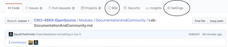

# Lab 3 Community Development and Unit Testing - June 7, 2019

## This Lab has two parts [Documentation](#part-1) and [Community](#part-2)

#### We talked about community and how people cooperate in order to contribute to a project. In this lab, we will explore this further using automatic tools, software and manually. ####

> This lab will be done in groups of 4-5. Each will be assigned a table number

> All the results should be documented in a `Lab3.md` and pushed to in your Github account.

### Part 1 - Documentation
1. Go to your lab repository and look for the wiki link at the top tab bar. If it isn't there, click on settings and check the wiki box near the bottom of the page.
    
1. Each person individually, on this wiki page (using Markdown or reStructuredText) write a brief description of some area of interest that you might want to explore in your project - It should include:

      1. The problem area that your software is researching or a technology or technologies that you might want to explore.
      2. Existing Software that addreses similar problems and how yours will be different or better; or examples of projects in your area of interest. Check out [LinksforPossibleProjects.md](../../Resources/LinksforPossibleProjects.md) in the resoures area to get ideas of both.
      3. Potential technologies you will use in your project; or any ideas about how where your technology might fit.
      4. The end product or goal.
 
    

    Note that all of this is preliminary. We don't need "good" answers, but I want you to be thinking about your project and this should be a first iteration of it. All of this together should take no more than one or two paragraphs. Here is a perfectly acceptable blurb. 

    >*I am not sure exactly what project I would like to do, but I am interested in medical image processing. I have been looking around and found two open source resources, [itk](http://www.itk.org) and [open-access-medical-image-repositories](http://www.aylward.org/notes/open-access-medical-image-repositories). The first is an open source toolkit for working with medical images and the second is a list of open data archives. This seems to be an active area of research with projects like [3D SLicer](https://slicer.org) being very popular. However, in looking through the site, 3D Slicer seems to be very difficult to learn.*

    >*I think I want to do something in this area that is maybe less powerful, but easier to use. I could consider using web technologies, which would required a web stack; or maybe just look at something that will help patients look at and understand their own data. What I would be focussing on is avoiding the complications of systems for research to make it more accessible to the patients themselves.*

2. Use latex [http://www.artofproblemsolving.com/texer](http://www.artofproblemsolving.com/texer) to generate the formulae depicted in [https://github.com/rcos/CSCI-4961-01-Summer-2018/blob/master/Labs/latex_formulae.png](https://github.com/rcos/CSCI-4961-01-Summer-2018/blob/master/Labs/latex_formulae.png)

3. Use latex to display a [Hadamard Matrix of size 4](http://mathworld.wolfram.com/HadamardMatrix.html) (equation 5). You can use just 1 and -1; although, if you want to make a matrix using the white and black boxes you are welcome to.


### Part 2 - Community
1. Break up into "tables" of 4-5 students.
1. Project selection
  1. Take a look at your assigned projects from [https://rcos.io/projects](https://rcos.io/projects) and clone them locally. All people at the table need to record the information for all projects, but each person can do one project and share the results with the group.
      
      **Table 1 gets project 1-5, table 2 takes 6-10, and so on... Adjust the numbers to the number of people at your table, but do at least 4.**

  2. For each of your projects, look up by hand and record in `Lab3.md`:
        - the number of contributors
        - number of lines of code
        
      > To get the lines of a project, try something like `git ls-files -z | xargs -0 wc -l` in the cloned project directory

        - the first commit
        - the latest commit
        - the current branches
   
   **Note: if the project you are assigned has no commits to its repository, pick a different project.**
    
2. Gitstats
  1. Install - This can be done in Windows or OSX, but it will be easiest on Linux. **Do not use WSL. I do not believe gnuplot works correctly with the windows environment. If you are on a Windows platform, use the native windows tools.**
      - Clone the project `https://github.com/hoxu/gitstats` locally `cd gitstats`, and run `make install`
      - Homebrew / Linuxbrew users can use `brew install --HEAD homebrew/head-only/gitstats`
      - If you have issues, an alternate version, specific to Python 3 can be found in [RCOS](https://github.com/rcos/gitstats). Use either the `futureized_gitstats` or `python3` branches.
      - Gitstats requires gnuplot. To install, run `sudo apt-get install gnuplot-x11` for Ubuntu (or the appropiate command for your platform, see [https://sourceforge.net/projects/gnuplot/](https://sourceforge.net/projects/gnuplot/)).

  2. Running
     - From the command line, run `gitstats <path to project1 git repo> <output path>` inside the cloned project directory
     - You can see the output in a browser by typing `file:///<output path>/index.html` in the address bar (use `pwd` from the command line to get the current path  )
     - You may also be able to open it from the command line using `xdg-open <output path>/index.html`, `sensible-browser <output path>/index.html`, or `sensible-browser <output path>/index.html`
     - Repeat this for each of the five projects.
  4. Compare to your results from #1 to these results and comment on your findings in `Lab3.md`.

    > If you are curious, please read and try to understand the [python code for gitstats](https://github.com/hoxu/gitstats/blob/master/gitstats). (Its even better if you suggest some improvements!)

3. Streaming Contribution Visualizations
   - Read the [webpage for gource](http://gource.io/).
   - Download gource using `sudo apt-get install gource` (or `brew install gource`) or install it via your favorite binary installer.
   - Go to each of the five cloned repository directories and execute the command
   `gource`
   - You will get a streaming video of the activity in that project.
   - Now, create a video of these projects.
   - Install ffmpeg using `sudo apt-get install ffmpeg` or install avconv using `sudo apt-get install avconv` (or `brew install <package name>`).
   - Execute the following two commands from each of the cloned repositories:
   
    ```
    gource -1280x720 -o gource.ppm --time-scale 3
    ffmpeg -y -r 60 -f image2pipe -vcodec ppm -i gource.ppm  -vcodec mpeg4 -b:v 3000k -s hd480 gource.mp4
    ```
    or
    
    ```
    gource -1280x720 -o gource.ppm --time-scale 3
    avconv -y -r 60 -f image2pipe -vcodec ppm -i gource.ppm  -vcodec mpeg4 -b:v 3000k -s hd480 gource.mp4
    ```
    or for a more fun gource, generate the ppm file with:
    
    ```
    gource -1280x720 -o gource.ppm --auto-skip-seconds 1 --max-files 0 --time-scale 3 --camera-mode track --file-idle-time 0 --bloom-multiplier 1.5  -e 0.5 --title "<Project Title>"
    ```

  - (Optional) If you would like, upload your video to Youtube and add a link in `Lab3.md`.

      > Example youtube videos - [Ruby](https://www.youtube.com/watch?v=si-kxnwKvjU) and  [Observatory   (old)](https://www.youtube.com/watch?v=SKArMLw1QY0)  and [CSCI 2961-01 Intro to Open Source](https://youtu.be/-R3-t0oLcpk )


  __Make sure to include screenshots and comments 	in your lab report.__

<!-- ### Part 3 - Unit Testing
1. Read the tutorial on unit tests from [pythontesting](http://pythontesting.net/framework/unittest/unittest-introduction).
(You will be using the unit test module.)

2.  Copy [`markdown.py`](https://github.com/okken/markdown.py/blob/master/markdown.py) and [`test_markdown_unittest.py`](https://github.com/okken/markdown.py/blob/master/test_markdown_unittest.py) from [okken/markdown.py](https://github.com/okken/markdown.py) and make sure that you can run them. If you have issues, an alternate version, specific to Python 3 can be found in [RCOS](https://github.com/rcos/markdown.py)
3. Fork the repository and clone your fork locally.

3.  In your fork, add translations for:
  - `#` => `<h1>` and `</h1>` 
  - `##` => `<h2>` and `</h2>` 
  - `###` => `<h3>` and `</h3>` 
  - `>` => `<blockquote>` and on the next line with no `>` end it with `</blockquote>` 

  > [Some Markdown examples](https://daringfireball.net/projects/markdown/basics) and [the source](https://daringfireball.net/projects/markdown/basics.text)
  >
  > Look under PARAGRAPHS, HEADERS, BLOCKQUOTES for exact input and output
  > 

4. Write unit tests for the three additional constructs you added.
5. Push your code to github. Add links to your code and testcode and a screenshot of the running tests to `Lab3.md`.

When you have completed the lab, submit a text file with a link to your `Lab3.md` file via Submitty.-->
