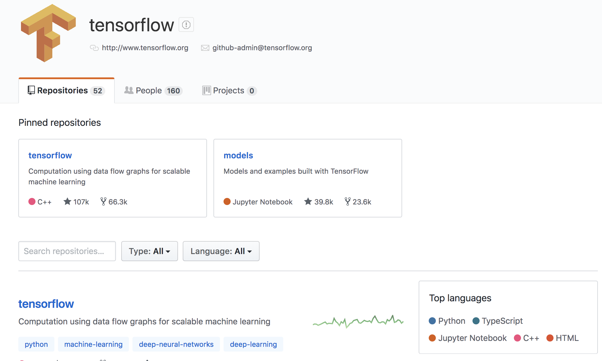
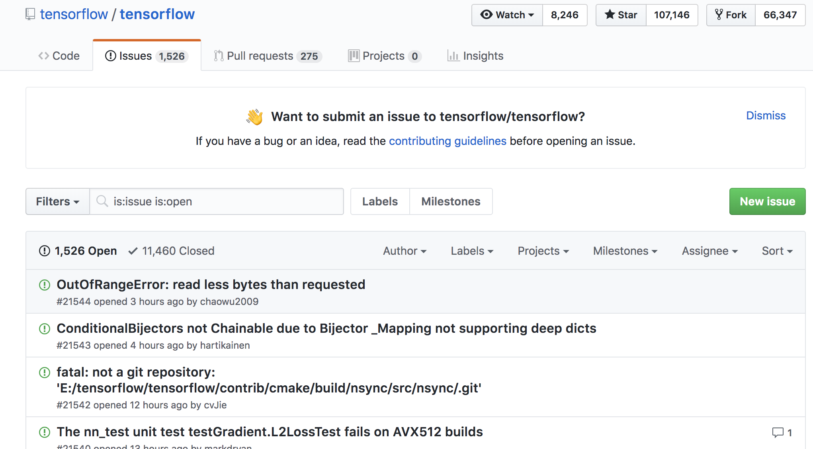
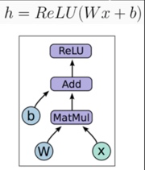
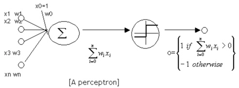
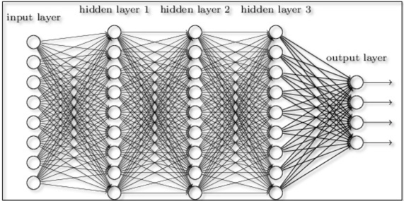
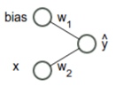

TensorFlow Tutorial
###################

Open Source Software - Summer 2018

Wesley Turner

Rensselaer Polytechnic Institute

Department of Computer Science

.. nextslide::

Licensed under: CC-BY-SA 4.0 https://creativecommons.org/licenses/by-sa/4.0/

Introduction
============

What is TensorFlow?
-------------------

.. pull-quote:: An open source machine learning framework for everyone [1]_

.. [1] https://www.tensorflow.org/

.. nextslide::

TensorFlow™ is:

* Open source 
  
* High performance numerical computation
  
* Deploys on  CPUs, GPUs, TPU
  
* Desktops, clusters, mobile and edge devices
 
* Originally developed by Google Brain team within Google’s AI organization
  
.. nextslide::

TensorFlow™ has:

* Strong support for machine learning 
  
* Strong support for deep learning
 
* Flexible numerical computation core

Widely Used
-----------

Companies:

.. nextslide::

Companies (continued):

.. image:: static/Companies2.png

.. nextslide::

Companies (continued):

.. image:: static/Companies3.png

By the Numbers
--------------

Github page: https://github.com/tensorflow

.. nextslide::

Main repository: https://github.com/tensorflow/tensorflow

* 53,075 commits

* 27 branches

* 1932 contributers

* 79 releases

* 2021 Issues

* Permissively licensed under Apache-2.0

.. image:: static/License.png

.. nextslide::

Active community
----------------

* Community overview: https://www.tensorflow.org/community/

.. image:: static/Community.png

.. nextslide::

* Insights at: https://github.com/tensorflow/tensorflow/graphs/contributors

.. image:: static/github2.png

.. nextslide::

* Blog: https://medium.com/tensorflow

.. image:: static/Blog.png

.. nextslide::

* Issue Tracker: https://github.com/tensorflow/tensorflow/issues

.. nextslide::

* Issue Tracker: https://stackoverflow.com/questions/tagged/tensorflow

.. image:: static/StackOverflow.png

.. nextslide::

Others:

* Twitter

* YouTube

* Release Notes

The Basics
==========

Much of this section courtesy of Olivier Poulin, one of our mentors

Multiple Installations
----------------------

* Virtualenv
 
* "native" pip

* Docker

* Source

.. nextslide::

For this class, we will use the Docker installation:

.. code-block:: console

  $ docker run -it -p 8888:8888 tensorflow/tensorflow
  Unable to find image 'tensorflow/tensorflow:latest-devel' locally
  latest-devel: Pulling from tensorflow/tensorflow
  8ee29e426c26: Pull complete 
  ...
  9c2312dbc5d7: Pull complete 
  Digest: sha256:40844012558fe881ec58faf1627fd4bb3f64fe9d46a2fd8af70f139244cfb538
  Status: Downloaded newer image for tensorflow/tensorflow:latest
  
  ________                               _______________                
  ___  __/__________________________________  ____/__  /________      __
  __  /  _  _ \_  __ \_  ___/  __ \_  ___/_  /_   __  /_  __ \_ | /| / /
  _  /   /  __/  / / /(__  )/ /_/ /  /   _  __/   _  / / /_/ /_ |/ |/ / 
  /_/    \___//_/ /_//____/ \____//_/    /_/      /_/  \____/____/|__/

.. nextslide::

Docker:

* Runs a TensorFLow Container

  * Bindings to Python

* Maps port 8888 on the Container to port 8888 outside the container

  * Allows you to run Jupyter Notebooks

* Starts up an interactive session

Validate
--------

From the Docker container:

.. code-block:: console

  # python
  Python 2.7.12 (default, Dec  4 2017, 14:50:18) 
  [GCC 5.4.0 20160609] on linux2
  Type "help", "copyright", "credits" or "license" for more information.

.. code-block:: python

  >>> import tensorflow as tf
  >>> hello = tf.constant('Hello, TensorFlow!')
  >>> sess = tf.Session()
  2018-08-09 19:31:10.894780: I tensorflow/core/platform/cpu_feature_guard.cc:141] Your CPU supports instructions that this TensorFlow binary was not compiled to use: AVX2 FMA
  >>> print sess.run(hello) 
  Hello, TensorFlow!

What does TensorFlow do?
------------------------

* Similar to Numpy, for n-dimensional arrays, but TensorFlow simplifies creation of tensor methods and computes derivatives.

+----------------------------------------+----------------------------------------+
| Numpy                                  | TensorFlow                             |
+========================================+========================================+
| a=np.zeros((2,2)); b=np.ones((2,2))    | a=tf.zeros((2,2)); b=tf.ones((2,2))    |
+----------------------------------------+----------------------------------------+
| np.sum(b,axis=1)                       | tf.reduce_sum(b,reduction_indices=[1]) |
+----------------------------------------+----------------------------------------+
| a.shape                                | a.get_shape()                          |
+----------------------------------------+----------------------------------------+
| np.reshape(a, (1,4))                   | tf.reshape(a, (1,4))                   |
+----------------------------------------+----------------------------------------+
| b * 5 + 1                              | b * 5 + 1                              |
+----------------------------------------+----------------------------------------+
| np.dot(a, b)                           | tf.matmul(a, b)                        |
+----------------------------------------+----------------------------------------+
| a[0,0], a[:,0], a[0,:]                 | a[0,0], a[:,0], a[0,:]                 |
+----------------------------------------+----------------------------------------+

Base usage involves making execution graph
------------------------------------------
* TensorFlow uses a computation graph that has no numerical value until it’s evaluated.
* Program structure has two phases: Construction phase and Execution phase.
* Construction phase assemble the computation graph. 
* Execution phase the session object to execute all the operations in the graph.

What is Deep Learning?
----------------------
* Deep learning is a machine learning method.
* More complex but has broader applications than classic task-specific algorithms.
* It bases the construction of its models on networks observed in biological nervous systems.
* Train Artificial Neural Networks to transform an input into a desired output. 

Neural Network
--------------
* A collection of units or nodes (artificial neurons, hence neural network)
* Connected in layers to one another. Each node sends data to other nodes
* Train the “weights” and “biases” on each neuron to slowly inch the network towards a specific functionality.

.. image:: static/Neural_Net.png

Simplest artificial neural network (ANN): Perceptron
----------------------------------------------------

* Only binary inputs/outputs
* Binary output means the signals between neurons can only be binary as well
* Something either is, or isn’t
* Limited in its functionality

Sigmoid Neurons
---------------

* Inputs/outputs are any values between 0 and 1‘
* Gives us much more nuanced outputs
* Can be used for % matches

.. image:: static/formula.png

.. image:: static/sigmoid.png

Deep Learning uses multiple layered networks
--------------------------------------------

How to train your dragon (network)
----------------------------------

* Compare the output with training data
* Get a vector of all the errors and compute the downward slope of the error curve (derivative)
* Change the weights based on this “Gradient Descent”
* Complicated in huge networks

.. image:: static/training.png

A simple linear example
-----------------------

* Simplifies everything!
* Example:  A simple linear regression!
* Linear function y = ab+c
* How do we train a simple network to mimic a linear function?
* Where bias = 1. This function becomes y = xw2 + w1

Get set up
----------

Run a docker container and update it

.. code-block:: console

  docker run -it -p 8888:8888 tensorflow/tensorflow:latest
  apt-get install python-tk
  pip install matplotlib

For OSX, you will need to install a few packages to get the plots at the end to work:

.. code-block:: console

  brew install socat
  socat TCP-LISTEN:6000,reuseaddr,fork UNIX-CLIENT:\"$DISPLAY\"
  brew install xquartz
  open -a Xquartz

  Then set Allow connections from network clients in the pop up

Run a simple example
--------------------

Imports:

.. code-block:: python

  import tensorflow as tf
  import numpy as np
  import matplotlib.pyplot as plt

Set up the system:

.. code-block:: python

  # Set up the data with a noisy linear relationship between X and Y
  # y = -4x - 2 (gaussian, mean 0, stddev 1)
  # bias is the coefficient of the contant term (1)
  num_examples = 50
  X = np.array([np.linspace(-2, 4, num_examples), \
    np.linspace(-6, 6, num_examples)])
  X += np.random.randn(2, num_examples)
  x, y = X
  bias_with_x = np.array([(1.0, a) for a in x]).astype(np.float32)

.. nextslide::

Training parameters:

.. code-block:: python

  # Keep track of losses to plot later
  losses = []
  # How many iteration of training
  training_steps = 50
  # Learning rate (step size to control gradient descent). Too large 
  # and you may jump past minima, too small and it takes forever.
  learning_rate = 0.002

.. nextslide::

Set up the TensorFlow graph:

.. code-block:: python

  with tf.Session() as sess:
    # Set up all the tensors. The input layer is x and bias
    input = tf.constant(bias_with_x)
    # Our output are the y values as a column vector
    target = tf.constant(np.transpose([y]).astype(np.float32))
    # Weights are what we are changing. Initialize them to random
    # values (gaussian, mean 0, stddev 0.1)
    weights = tf.Variable(tf.random_normal([2, 1], 0, 0.1))
    # Now initialize the variables
    tf.global_variables_initializer().run()

.. nextslide::

Still within the with:

.. code-block:: python

  # with tf.Session() as sess:
    #
    # Set up the operations that will run in the loop
    # For all x values, generate an estimate for y given our current
    # weights. I.e. y^ = w2 * x + w1 * bias
    yhat = tf.matmul(input, weights)
    # The error is our estimate minus the measured
    yerror = tf.subtract(yhat, target)
    # Use the L2 magnitude over all estimates as the error function
    loss = tf.nn.l2_loss(yerror)
    # Now do gradient descent to optimize the weights.
    update_weights = tf.train.GradientDescentOptimizer(learning_rate).\
    minimize(loss)

.. nextslide::

Still within the with:

.. code-block:: python

  # with tf.Session() as sess:
    #
    # We have defined all the tensors, run the initialization and
    # set up the execution graph to run the training data. Now repeatedly
    # call the training operation to execute gradient descent and 
    # optimize the weights.
    for _ in range(training_steps):
        # Run an iteration of gradient descent
        sess.run(update_weights)
        # Save our loss magnitude so we can plot it later.
        losses.append(loss.eval())
    # When we are done training, get the final values for the charts.
    betas = weights.eval()
    yhat = yhat.eval()

.. nextslide::

Still within the with:

.. code-block:: python

  # Show the results
  fig, (ax1, ax2) = plt.subplots(1,2)
  plt.subplots_adjust(wspace=0.3)
  fig.set_size_inches(10, 4)
  ax1.scatter(x, y, alpha=0.7)
  ax1.scatter(x, np.transpose(yhat)[0], c="g", alpha=0.6)
  line_x_range = (-4, 6)
  ax1.plot(line_x_range, [betas[0] + a * betas[1] \
    for a in line_x_range], "g", alpha=0.6)
  ax2.plot(range(0, training_steps), losses)
  ax2.set_ylabel("Loss")
  ax2.set_xlabel("Training steps")
  plt.show()

Using TensorFlow
================

Tutorial
--------

Of course, Google has us covered:
https://www.youtube.com/watch?v=tjsHSIG8I08

.. image:: static/Video.png

.. nextslide::

Website from the video:
https://github.com/tensorflow/workshops

.. image:: static/Workshop.png

.. nextslide::

Other links:

* https://colab.research.google.com/

* https://js.tensorflow.org/

* https://ai.google/education/

